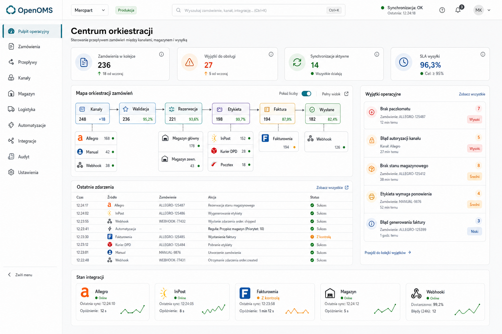

# OPE-242: Dashboard shell redesign and visual system

## Cel

Zbudowac docelowy kierunek dashboardu OpenOMS jako **centrum orkiestracji zamowien**, nie jako panel sklepu. OpenOMS ma pokazywac, jak zamowienia przeplywaja przez kanaly sprzedazy, walidacje, magazyn, automatyzacje, logistyke, dokumenty i webhooki.

Referencja wizualna:

## Definicja produktu

OpenOMS nie jest sklepem internetowym. To warstwa koordynacji operacji e-commerce:

- przyjmuje zamowienia z roznych kanalow,
- normalizuje je do jednego modelu,
- pilnuje deduplikacji i walidacji,
- rezerwuje lub kieruje realizacje przez magazyn,
- uruchamia automatyzacje i webhooki,
- tworzy przesylki i etykiety,
- obsluguje faktury, zwroty i audyt,
- pokazuje, gdzie proces utknal i co trzeba naprawic.

Pulpit ma odpowiadac na pytania:

- czy przeplyw zamowien dziala zdrowo,
- gdzie tworzy sie zator,
- co wymaga reakcji teraz,
- ktore integracje sa aktywne lub uszkodzone,
- co system wykonal automatycznie.

## Kierunek UI

Wybrany kierunek to **Operations Control Tower**. Glowny ekran ma byc streszczeniem operacji, a nie katalogiem funkcji.

Priorytety:

- dashboard pokazuje wyjatki i zdrowie przeplywu, nie wszystko naraz,
- mapa orkiestracji jest kompaktowym paskiem etapow,
- szczegoly sa dostepne po kliknieciu w etap, provider albo wyjatek,
- puste stany prowadza do konfiguracji kanalow, kurierow i pierwszego zamowienia,
- UI jest spokojne, profesjonalne, gesta informacja bez chaosu.

## Mapa Orkiestracji

Mapa nie jest pelnym grafem systemu. Na dashboardzie powinna byc warstwa streszczenia:

`Przyjecie -> Walidacja -> Realizacja -> Automatyzacje -> Wysylka -> Zakonczone`

Pierwszy PR moze pokazac tylko etapy, ktore maja pewne zrodlo danych w istniejacych API. Etapy bez wiarygodnego zrodla danych nie powinny byc renderowane jako puste lub udawane.

Kazdy etap pokazuje tylko:

- liczbe spraw w kolejce,
- liczbe wyjatkow,
- stan: `OK`, `Uwaga`, `Problem`,
- link do przefiltrowanej listy szczegolow.

Etapy:

- `Przyjecie`: zamowienia nowe i potwierdzone z kanalow,
- `Walidacja`: zamowienia wymagajace uzupelnienia danych lub uwagi,
- `Realizacja`: zamowienia w przygotowaniu i gotowe do wysylki,
- `Automatyzacje`: zaplanowane lub nieudane akcje automatyzacji,
- `Wysylka`: przesylki utworzone, z etykieta, w transporcie lub nieudane,
- `Zakonczone`: dostarczone i zamkniete zamowienia.

## Bez Smietnika Na Dashboardzie

Dashboard nie powinien pokazywac kazdego eventu, kazdego providera i kazdego rekordu. Widok domyslny ma miec trzy poziomy:

1. **Stan przeplywu**: kompaktowa mapa etapow.
2. **Do obsluzenia teraz**: maksymalnie 5-7 najwazniejszych wyjatkow.
3. **Zdrowie systemu**: stan gotowych integracji i najnowsze wazne zdarzenia.

Pelny event stream, szczegoly integracji, listy zamowien i pelne logi zostaja w osobnych ekranach.

## Zasada Interakcji

Dashboard nie moze pokazywac akcji, ktorych produkt realnie nie obsluguje.

Dozwolone:

- link do istniejacego ekranu,
- link do istniejacego rekordu, jesli ID i route istnieja,
- informacja statusowa bez przycisku,
- CTA do skonfigurowania gotowego providera.

Niedozwolone:

- przyciski `Ponow`, `Napraw`, `Uruchom`, jesli nie ma endpointu albo dzialajacego flow,
- disabled "coming soon" jako obietnica funkcji,
- filtrowane linki, jesli strona docelowa nie czyta tych parametrow,
- pokazanie providera jako wyboru, jesli readiness nie dopuszcza go w client-ready mode.

## Wyjatki Operacyjne

Najwazniejsza sekcja dashboardu to lista rzeczy wymagajacych reakcji.

Przyklady:

- integracja ma status `error`,
- przesylka ma status `failed`,
- zamowienie ma status `on_hold`,
- zamowienie ma priorytet `urgent` albo `high`,
- webhook delivery ma status `failed`,
- automatyzacja ma nieudane opoznione akcje.

Kazdy wyjatek powinien miec:

- krotki tytul,
- typ i wage,
- link do miejsca naprawy,
- jedna oczywista nawigacje: `Otworz` albo `Skonfiguruj`, tylko jesli istnieje realny ekran docelowy.

## Stan Integracji

Integracje nie powinny robic chaosu na mapie. Na dashboardzie pokazujemy tylko stan zdrowia:

- Allegro,
- InPost,
- Fakturownia, jesli skonfigurowana albo widoczna w readiness,
- Webhooki,
- Magazyn / realizacja.

Provider gotowy (`ready`) moze byc widoczny. Provider niezweryfikowany nie powinien byc aktywnym wyborem w client-ready mode.

## Nawigacja

Menu powinno opisywac obszary orkiestracji, nie sklep ani techniczne implementacje.

Docelowy model:

- Pulpit operacyjny
- Zamowienia
- Przeplywy
- Kanaly
- Magazyn
- Logistyka
- Automatyzacje
- Integracje
- Audyt
- Ustawienia
- Pomoc

Zasady:

- `Marketplace` nie jest glowna etykieta polskiego UI,
- Allegro jest providerem w obszarze kanalow, nie osobna koncepcja obok sklepow i integracji,
- Kurierzy sa czescia logistyki,
- Audit i eventy sa narzedziami diagnostycznymi, nie podstawowym ekranem operatora,
- niedzialajace funkcje pozostaja ukryte w client-ready mode.

## Visual System

Styl:

- off-white neutralne tlo,
- biale powierzchnie robocze,
- cienkie szare ramki,
- grafitowy tekst,
- spokojny teal/blue dla aktywnych elementow,
- zielony/amber/czerwony dla stanu systemu,
- radius 6-8px,
- bez gradientowych ozdob, blobow, glassmorphism i marketingowego hero.

Typografia ma byc kompaktowa. Pulpit ma byc czytelny przy codziennym, powtarzalnym uzyciu.

## Zakres OPE-242

OPE-242 powinien objac:

- korekte dashboard home do modelu control tower,
- kompaktowa mape orkiestracji,
- sekcje `Do obsluzenia teraz`,
- panel zdrowia integracji,
- ograniczony event stream waznych zdarzen,
- korekte nazewnictwa menu,
- lekki visual system pass dla shell layoutu.

Poza zakresem:

- certyfikacja nowych providerow,
- wlaczanie niegotowych kanalow lub kurierow,
- pelna przebudowa wszystkich list i formularzy,
- zaawansowany workflow builder,
- pelny system alertowania realtime.

## Akceptacja

Zmiana jest gotowa, gdy:

- pulpit nie wyglada jak sklep ani dashboard sprzedazy,
- najwazniejsza informacja to zdrowie przeplywu i wyjatki,
- mapa orkiestracji jest kompaktowa i nie tworzy smietnika,
- uzytkownik widzi maksymalnie kilka najwazniejszych problemow,
- klikniecie w etap albo wyjatek prowadzi do konkretnego miejsca pracy,
- UI jest zgodne z referencja wizualna,
- desktop i mobile przechodza manualny browser pass.

## Status implementacji

2026-05-11: OPE-242 pierwszy pass implementacyjny przeniosl home dashboardu z raportowania sprzedazowego na operations control tower. Widok uzywa istniejacych danych: etapow przeplywu zamowien, ograniczonej kolejki wyjatkow, zdrowia widocznych gotowych integracji i ostatniej aktywnosci zamowien. Nie dodaje przyciskow naprawy/ponowienia ani linkow do ukrytych providerow.

2026-05-11: Drugi pass wizualny zblizyl implementacje do zaakceptowanej referencji: shell ma jasniejszy sidebar, topbar z realnym triggerem Command Palette, home ma pasek metryk, prawa kolumne wyjatkow, bardziej kompaktowa mape etapow i gestsza tabele ostatniej aktywnosci. Dodatkowo onboardingowe requesty admin-only sa bramkowane rola, zeby zwykly operator nie dostawal ukrytych bledow autoryzacji na pulpicie.
