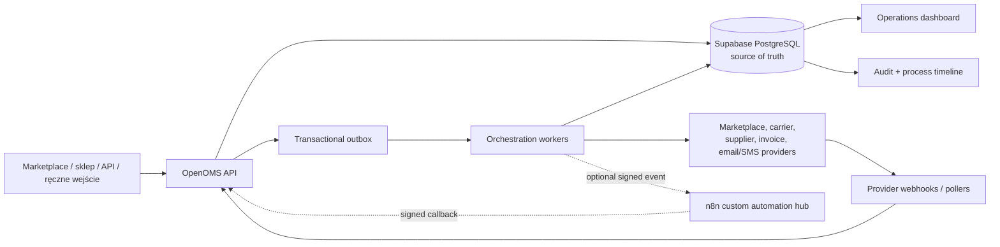
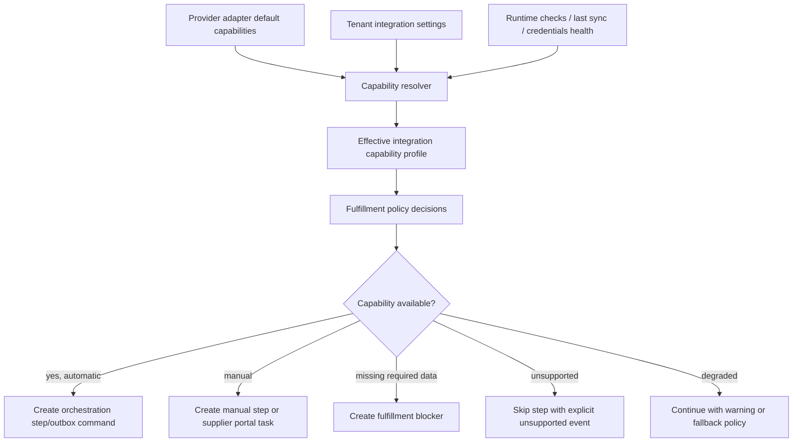
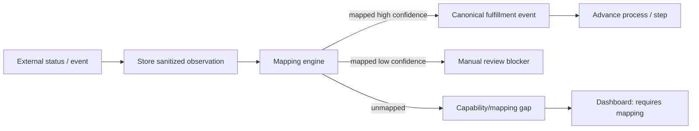
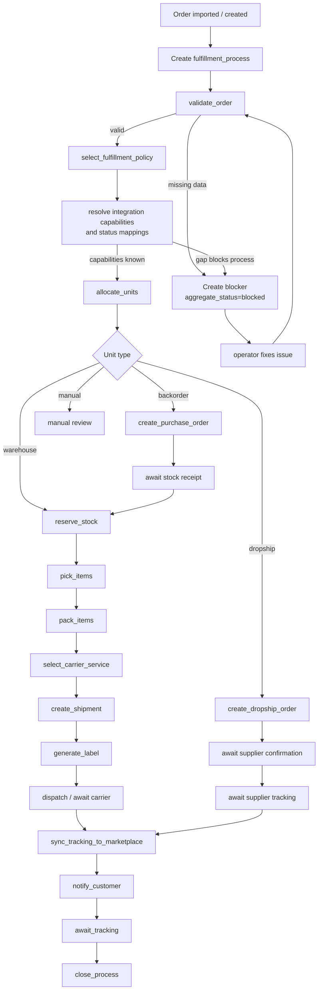
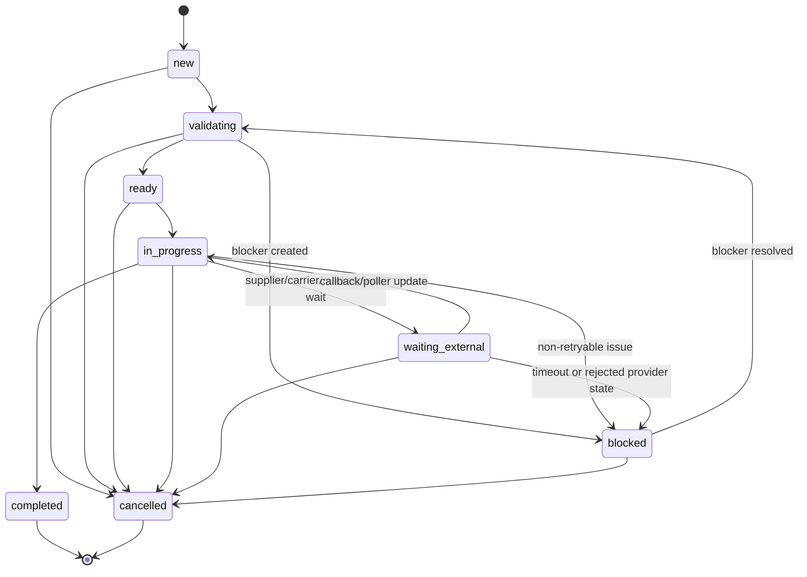
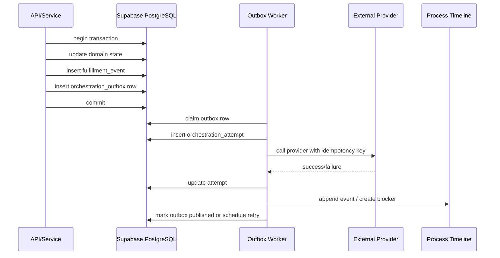

# Fulfillment Orchestration — Design Document

- **Date:** 2026-05-17
- **Status:** Draft for review
- **Scope:** OpenOMS public repo: Go API, dashboard, PostgreSQL/Supabase data model, workers, automation, shipment, dropship, warehouse, marketplace synchronization.
- **Companion research:** `2026-05-17-supplier-integration-research.md` maps supplier/wholesale communication models, capability profiles, evidence, and status mapping requirements.
- **Companion ADRs/plans:** `2026-05-21-ope-424-canonical-logistics-state-adr.md`, `2026-05-21-ope-425-orchestration-data-lifecycle.md`, and `../plans/2026-05-21-ope-420-provider-integration-studio-implementation-plan.md` define the planning gate outputs before implementation.
- **Companion tooling design:** `2026-05-17-provider-integration-studio-design.md`, `2026-05-17-provider-integration-studio-gap-analysis.md`, `2026-05-17-provider-integration-studio-production-readiness.md`, and `2026-05-17-provider-integration-studio-ui-ux-design.md` define the internal platform-admin validator, publication flow, required environment changes, production readiness gates and platform-admin UI/UX for provider integrations.

## Context

OpenOMS already has most domain pieces needed for fulfillment: orders, shipments, label generation, tracking pollers, dropship orders, purchase orders, warehouse documents, pick-pack sessions, automation rules, webhook deliveries, audit logs, and an operations dashboard.

The current weakness is not lack of features. The weakness is that process truth is spread across many paths:

- Manual/API order creation goes through `OrderService.Create`, but marketplace pollers insert orders directly through repositories.
- Shipment creation and status changes emit events in some paths, but label generation directly moves a shipment to `label_ready`.
- Bulk order status changes update state but do not consistently fire automation.
- Pick-pack uses a `packed` order status that is not part of the canonical order state machine.
- Dropship and purchase order flows exist, but they are not unified into the order fulfillment state visible to operators.
- The dashboard derives operational state from orders, failed shipments, on-hold orders, and integration status, rather than from a first-class orchestration model.

The target architecture must therefore introduce a durable fulfillment process layer. It should make the system transparent, automatable, inspectable, and recoverable without making the dashboard noisy.

## Long-Term Principle

This design treats fulfillment orchestration as a core OpenOMS product capability, not as a tactical automation layer.

The source of truth remains **managed PostgreSQL on Supabase** for production. Local PostgreSQL is only for development and isolated restore tests. Redis can support queues, locks, and scheduling, but Redis must not become the durable truth for order progress. n8n is allowed only as a controlled custom automation connector and must not own core fulfillment state.

## Selected Architecture

OpenOMS should implement its own **Fulfillment Orchestrator** in Go, backed by Supabase PostgreSQL, with a transactional outbox and idempotent workers.

The orchestrator owns:

- process state,
- unit allocation,
- step execution,
- blockers,
- attempts,
- retries,
- event timeline,
- dashboard read model,
- built-in policy execution,
- safe extension points for tenant automation.

n8n, Temporal, or Camunda can still be useful in narrow roles, but they should not replace the OpenOMS process model:

- **n8n:** external customer automation hub for non-core actions.
- **Temporal:** possible future durable execution engine if OpenOMS workflows become too complex for the in-app orchestrator.
- **Camunda/Zeebe:** possible future enterprise BPMN layer if customer-facing BPMN becomes a paid requirement.

## Architecture Overview

Core rule: every business state transition and every external side effect must become visible through the fulfillment process model.

## Data Model

The data model should separate five concerns:

1. **Commercial order state** — what the customer/marketplace sees.
2. **Fulfillment process state** — how OpenOMS is progressing internally.
3. **Physical execution state** — warehouse, dropship, shipment, tracking.
4. **Operational blockers** — why a process cannot continue.
5. **Automation decisions** — why the system selected an action.

## Integration Capability And Mapping Model

OpenOMS must not assume that every marketplace, supplier, carrier, or shop integration can provide the same information. Each integration needs a declared and verified capability profile.

This profile answers five questions:

1. What information can this integration provide?
2. What actions can OpenOMS perform through it?
3. How does the information arrive?
4. How reliable and fresh is the information?
5. What is missing, and what should the operator or tenant policy do about it?

This turns unknown provider behavior into an explicit product feature: OpenOMS can show what is automated, what is manual, what is degraded, and what blocks the process.

### Capability Dimensions

Every integration capability should be described with stable dimensions:

- `entity_type`: `order`, `order_status`, `shipment`, `tracking`, `supplier_order`, `inventory`, `price`, `product`, `invoice`, `return`.
- `operation`: `read`, `create`, `update`, `cancel`, `acknowledge`, `push`, `pull`, `map`, `manual_confirm`.
- `direction`: `inbound`, `outbound`, `bidirectional`.
- `channel`: `api`, `webhook`, `poller`, `feed`, `csv_import`, `xml_import`, `sftp_file`, `email`, `supplier_portal`, `manual`, `none`.
- `freshness`: `realtime`, `near_realtime`, `scheduled`, `on_demand`, `manual`, `unknown`.
- `authority`: `authoritative`, `provider_claim`, `derived`, `operator_confirmed`, `untrusted`.
- `support_status`: `supported`, `configured`, `unsupported`, `requires_manual`, `degraded`, `unknown`.
- `required_fields`: list of data required to execute the capability.
- `provided_fields`: list of fields the integration actually provides.
- `latency_sla_seconds`: expected delay before OpenOMS should consider the capability stale.

Examples:

| Integration kind | Capability | Channel | Meaning |
| --- | --- | --- | --- |
| Marketplace API | Pull new orders | `api` / `poller` | OpenOMS can import orders automatically. |
| Marketplace API | Push tracking | `api` | OpenOMS can send tracking back to marketplace. |
| Supplier XML feed | Read inventory | `feed` | OpenOMS can update stock/availability, but not supplier order status. |
| Supplier without API | Confirm dropship order | `manual` / `supplier_portal` | Operator or supplier portal confirms progress. |
| Carrier without tracking API | Tracking status | `none` / `manual` | Tracking is not automated; process waits for manual confirmation or customer/marketplace signal. |
| CSV marketplace import | New orders | `csv_import` | Orders can be imported, but there is no ongoing status sync unless another capability exists. |

### Capability Resolution Flow

### Status And Event Mapping

External statuses must never be written directly into canonical OpenOMS state. They must be normalized through mappings.

Mapping levels:

1. **System default mapping** — shipped with provider adapter.
2. **Provider version mapping** — when a provider changes status vocabulary or API version.
3. **Tenant override mapping** — when a tenant uses custom statuses in a shop or supplier process.
4. **Integration override mapping** — when one specific integration account differs from the default.

Mapping fields:

- `provider`
- `integration_id`
- `external_entity_type`
- `external_status`
- `external_status_label`
- `canonical_event_type`
- `canonical_step_key`
- `canonical_status`
- `confidence`
- `terminal`
- `requires_operator_review`
- `valid_from`
- `version`

If a status cannot be mapped, OpenOMS must not guess. It should append an event with `external_status_unmapped`, attach the raw safe status value, and create either:

- a warning when the missing mapping does not block fulfillment, or
- a blocker when the next system action depends on the meaning of that status.

### Evidence Model

OpenOMS should distinguish between what is known, assumed, inferred, and manually confirmed.

Evidence types:

- `api_response`
- `webhook`
- `poller_result`
- `feed_row`
- `csv_import`
- `supplier_portal_update`
- `operator_entry`
- `email_parsed`
- `system_inference`

Each important external observation should be stored as a redacted evidence record linked to process/unit/step/attempt where relevant. This gives operators traceability without storing secrets or unnecessary PII.

### Provider-Agnostic Modeling Rule

Named integrations in this document are representatives of capability classes. The orchestration model must not branch on provider names outside adapter construction, provider registry definitions, validation probes and explicitly versioned mappings.

Core fulfillment logic must reason about:

- capability class,
- declared supported/manual/partial/unsupported/unknown capability state,
- canonical OpenOMS status,
- external status mapping,
- evidence source,
- blocker type,
- tenant policy.

This keeps Allegro, InPost, BTP and later providers from becoming hidden assumptions in the workflow engine.

### Capability Gaps

A capability gap is not always an error. It is a known limitation of a specific integration.

Gap severity:

- `info`: OpenOMS knows the capability is unavailable and no process step depends on it.
- `warning`: fulfillment can continue, but transparency is reduced.
- `action_required`: operator or tenant must provide missing data or mapping.
- `system_error`: OpenOMS expected the capability to work, but it failed unexpectedly.

Examples:

- Supplier has inventory feed but no order API: create a manual/supplier-portal dropship step, not a system error.
- Marketplace accepts tracking but carrier cannot provide tracking: fulfillment can ship, but tracking sync is blocked until manual tracking is entered.
- Supplier feed has stock but no lead time: use tenant policy fallback or mark ETA as unknown.
- Custom shop status `ready_for_warehouse` is unmapped: create mapping blocker before auto-reserving stock.
- Carrier supports labels but tenant credentials are invalid: system error/action required.

### Dashboard Representation

The dashboard should show capability gaps in plain language:

- “Dostawca BTP: automatyczne zamówienia aktywne, tracking wymaga ręcznego uzupełnienia.”
- “Sklep WooCommerce: status `ready_to_pack` nie jest zmapowany.”
- “DHL: etykiety dostępne, odbiór kuriera nieobsługiwany w tej integracji.”
- “Dostawca XML: mamy stock i ceny, ale nie mamy potwierdzenia realizacji zamówienia.”

The main dashboard remains high-level. Detailed capability and mapping information belongs in integration detail, process detail, and blocker detail views.

### Tables

#### `fulfillment_processes`

One process per order, or one process per order group if merged/split fulfillment is used.

Important columns:

- `id`
- `tenant_id`
- `order_id`
- `source`
- `policy_id`
- `aggregate_status`
- `health_status`
- `current_stage`
- `started_at`
- `completed_at`
- `updated_at`
- `version`

`aggregate_status` is the operator-facing state. It should remain small and stable:

- `new`
- `validating`
- `ready`
- `in_progress`
- `waiting_external`
- `blocked`
- `completed`
- `cancelled`

`health_status` is independent from progress:

- `ok`
- `warning`
- `action_required`
- `system_error`

#### `fulfillment_units`

Represents a fulfillable part of the order. A single order can produce several units.

Important columns:

- `id`
- `tenant_id`
- `process_id`
- `order_id`
- `unit_type`
- `status`
- `warehouse_id`
- `supplier_id`
- `shipment_id`
- `purchase_order_id`
- `line_items`
- `external_reference`
- `created_at`
- `updated_at`

`unit_type`:

- `warehouse`
- `dropship`
- `backorder`
- `mixed_child`
- `manual`

#### `fulfillment_steps`

Tracks the canonical execution steps for each process/unit.

Important columns:

- `id`
- `tenant_id`
- `process_id`
- `unit_id`
- `step_key`
- `status`
- `attempt_count`
- `next_attempt_at`
- `last_attempt_at`
- `last_error_code`
- `last_error_message`
- `blocked_by_id`
- `started_at`
- `completed_at`

Step status:

- `pending`
- `ready`
- `running`
- `waiting_external`
- `blocked`
- `succeeded`
- `failed`
- `skipped`
- `cancelled`

Canonical step keys:

- `validate_order`
- `select_fulfillment_policy`
- `allocate_units`
- `reserve_stock`
- `create_purchase_order`
- `create_dropship_order`
- `confirm_supplier_order`
- `pick_items`
- `pack_items`
- `select_carrier_service`
- `create_shipment`
- `generate_label`
- `create_dispatch_order`
- `sync_tracking_to_marketplace`
- `notify_customer`
- `await_tracking`
- `close_process`

#### `fulfillment_events`

Append-only process timeline.

Important columns:

- `id`
- `tenant_id`
- `process_id`
- `unit_id`
- `step_id`
- `event_type`
- `severity`
- `actor_type`
- `actor_id`
- `provider`
- `correlation_id`
- `payload`
- `created_at`

Payload must be redacted by default. PII should not be duplicated unless it is required for audit, and secrets must never be stored here.

#### `fulfillment_blockers`

User-facing and operator-facing reasons why the process cannot advance.

Important columns:

- `id`
- `tenant_id`
- `process_id`
- `unit_id`
- `step_id`
- `code`
- `severity`
- `category`
- `message`
- `required_action`
- `retryable`
- `owner_type`
- `resolved_at`
- `resolved_by`
- `resolution_note`
- `created_at`
- `updated_at`

Blocker codes should be typed and stable:

- `missing_recipient_phone`
- `missing_shipping_address`
- `missing_pickup_point`
- `payment_not_confirmed`
- `insufficient_stock`
- `no_supplier_route`
- `supplier_credentials_invalid`
- `supplier_order_rejected`
- `carrier_credentials_invalid`
- `carrier_service_unavailable`
- `carrier_mapping_missing`
- `integration_capability_missing`
- `integration_capability_degraded`
- `external_status_unmapped`
- `stale_supplier_feed`
- `supplier_feed_missing_field`
- `manual_supplier_confirmation_required`
- `tracking_not_available`
- `label_generation_failed`
- `tracking_sync_failed`
- `marketplace_sync_failed`
- `manual_review_required`

#### `orchestration_outbox`

Reliable event and command dispatch.

Important columns:

- `id`
- `tenant_id`
- `aggregate_type`
- `aggregate_id`
- `event_type`
- `idempotency_key`
- `payload`
- `status`
- `attempt_count`
- `next_attempt_at`
- `last_error`
- `created_at`
- `published_at`

Every event that triggers side effects must be written in the same transaction as the domain state change.

#### `orchestration_attempts`

Detailed execution attempts for external calls and system actions.

Important columns:

- `id`
- `tenant_id`
- `process_id`
- `step_id`
- `action_type`
- `provider`
- `idempotency_key`
- `status`
- `started_at`
- `finished_at`
- `duration_ms`
- `request_hash`
- `response_status`
- `error_code`
- `error_message`

This table is the operational source for debugging provider and automation failures.

#### `fulfillment_policies`

Versioned built-in and tenant-specific policy configuration.

Important columns:

- `id`
- `tenant_id`
- `name`
- `scope`
- `version`
- `enabled`
- `definition`
- `created_by`
- `created_at`
- `activated_at`

`scope`:

- `system`
- `tenant`
- `integration`
- `warehouse`
- `marketplace`

Policies are not arbitrary code. They are structured configuration mapped to typed OpenOMS actions.

#### `provider_capability_definitions`

System-level capability declarations shipped with provider adapters.

Important columns:

- `id`
- `provider_type`
- `provider`
- `adapter_version`
- `entity_type`
- `operation`
- `direction`
- `default_channel`
- `default_freshness`
- `default_authority`
- `required_fields`
- `provided_fields`
- `supports_status_mapping`
- `created_at`
- `updated_at`

This table describes what the OpenOMS adapter knows how to do in principle.

#### `integration_capability_profiles`

Tenant-specific effective capabilities for a configured integration.

Important columns:

- `id`
- `tenant_id`
- `integration_id`
- `supplier_id`
- `provider_type`
- `provider`
- `entity_type`
- `operation`
- `channel`
- `freshness`
- `authority`
- `support_status`
- `required_fields`
- `provided_fields`
- `missing_fields`
- `latency_sla_seconds`
- `last_verified_at`
- `last_success_at`
- `last_failure_at`
- `last_failure_code`
- `configuration_source`
- `created_at`
- `updated_at`

This table describes what this tenant's integration can actually do now.

#### `external_status_mappings`

Versioned mapping from provider-specific statuses to OpenOMS canonical events, steps, and statuses.

Important columns:

- `id`
- `tenant_id`
- `integration_id`
- `provider_type`
- `provider`
- `external_entity_type`
- `external_status`
- `external_status_label`
- `canonical_event_type`
- `canonical_step_key`
- `canonical_status`
- `confidence`
- `terminal`
- `requires_operator_review`
- `scope`
- `version`
- `valid_from`
- `created_by`
- `created_at`
- `updated_at`

`scope`:

- `system`
- `provider_version`
- `tenant`
- `integration`

#### `integration_observations`

Redacted external facts received from providers, feeds, files, portals, or operators.

Important columns:

- `id`
- `tenant_id`
- `integration_id`
- `supplier_id`
- `process_id`
- `unit_id`
- `step_id`
- `provider_type`
- `provider`
- `evidence_type`
- `external_entity_type`
- `external_entity_id`
- `external_status`
- `received_at`
- `observed_at`
- `payload_hash`
- `payload_redacted`
- `mapping_id`
- `mapping_result`
- `created_at`

This table lets OpenOMS explain where a status came from without treating every provider value as canonical truth.

#### `integration_capability_gaps`

Persistent, queryable record of missing or degraded integration capabilities.

Important columns:

- `id`
- `tenant_id`
- `integration_id`
- `supplier_id`
- `process_id`
- `unit_id`
- `capability_profile_id`
- `gap_code`
- `severity`
- `message`
- `required_action`
- `resolved_at`
- `resolved_by`
- `created_at`
- `updated_at`

Capability gaps can create fulfillment blockers, but they can also remain informational when the process can safely continue.

## Supabase/Postgres Architecture

Production state should live in Supabase PostgreSQL.

Required roles:

- `openoms_app` — API runtime role, tenant-scoped, RLS enforced.
- `openoms_worker` — controlled privileged worker role for cross-tenant workers and provider webhooks.
- `openoms_migration` — migration and schema owner role.
- `postgres` — administrative role used only for controlled operations.

Connection rules:

- API runtime uses pooled application connections.
- Workers use conservative pool sizes and a separate worker DSN.
- Migrations, `pg_dump`, restore validation, and schema operations use a direct or session connection appropriate for Postgres-native commands.
- Transaction pooler mode must not be used where prepared statements or session-level behavior are required.

Database rules:

- Every new tenant-scoped table has `tenant_id`.
- RLS is enabled and forced.
- Policies must require `current_setting('app.current_tenant_id', true)` and must not fall back to tautologies.
- Security-definer functions must be reviewed, execute privileges narrowed, and public execute revoked.
- New migrations must be backward-compatible.
- Long-running migrations must include lock and statement timeout strategy.
- Supabase backups/PITR remain part of the operational plan, and OpenOMS continues independent backup validation to external object storage.

Relevant Supabase docs:

- https://supabase.com/docs/guides/database/connecting-to-postgres
- https://supabase.com/docs/guides/database/connection-management
- https://supabase.com/docs/guides/platform/backups

## Process Flow

## State Model

The existing order status remains business-facing. Fulfillment progress is modeled separately and can derive business status when appropriate.

## Marketplace And Shop Flow

Marketplace and shop integrations should be treated as external systems with capability profiles, not as a uniform API shape.

For each marketplace/shop account, OpenOMS needs to know:

- whether orders arrive through API polling, webhooks, CSV import, manual import, or another channel;
- whether payment status is authoritative or only informational;
- whether external statuses can be read;
- whether OpenOMS can acknowledge an order;
- whether OpenOMS can push order status;
- whether OpenOMS can push shipment tracking;
- whether status changes are synchronous or asynchronous;
- whether custom shop statuses need tenant-specific mapping.

Marketplace-specific and shop-specific statuses must enter OpenOMS as `integration_observations`, then pass through `external_status_mappings`. Unknown statuses create mapping gaps instead of silently changing order state.

Class examples:

- Marketplace tracking push is an outbound capability; Allegro is one representative provider for this class.
- Self-hosted shop custom statuses require tenant mapping before automation depends on them; WooCommerce is one representative provider for this class.
- CSV-imported orders may have no live external status capability.
- A marketplace that accepts tracking asynchronously should create a pending sync attempt and wait for confirmation or retry outcome.

## Warehouse Flow

Warehouse fulfillment covers inventory-owned orders.

1. Validate address, delivery method, payment state, line items, and carrier mapping.
2. Reserve stock using tenant and warehouse context.
3. Create a pick-pack session or enqueue order into an existing wave.
4. Pick items.
5. Pack items.
6. Select carrier service.
7. Create shipment.
8. Generate label.
9. Optionally create dispatch order.
10. Sync tracking to marketplace.
11. Notify customer.
12. Track carrier status until delivered or failed.

Warehouse flow must avoid writing a new ad-hoc order status for every physical action. `packed` should become a fulfillment step result, not a canonical order state unless the product explicitly decides to expose it.

## Inventory Availability And Cross-Channel Stock Propagation

Inventory availability is a core orchestration concern, not only a marketplace worker concern. OpenOMS must own one canonical availability decision per tenant, product, variant, warehouse, supplier source, and sales channel. Marketplace stock, shop stock, supplier stock, and operator-entered stock are inputs or outputs of that decision, not separate sources of durable truth.

The default operating mode should be automatic:

1. When an order is imported from marketplace X, shop Y, API, CSV, or manual entry, OpenOMS reserves or allocates stock through the fulfillment process.
2. The reservation reduces canonical `available_to_sell`.
3. OpenOMS enqueues durable stock propagation commands for every listing/channel with automatic stock sync enabled.
4. Each marketplace/shop adapter pushes the new quantity according to its capability profile: synchronous API, bulk API, async feed, webhook-style acknowledgement, or declared unsupported.
5. Each attempt stores evidence, retry state, and final outcome.
6. A failed or stale propagation creates a typed blocker such as `stock_sync_failed`, `channel_stock_stale`, `capability_unsupported`, or `manual_stock_review_required`.

The same model must work in the opposite direction. When availability increases because a warehouse document is confirmed, a return is accepted back into stock, a purchase order is received, an inventory correction is approved, a supplier feed reports more availability, or a dropship supplier availability check becomes fresh again, OpenOMS recalculates `available_to_sell` and pushes the increased stock to eligible channels.

Manual control remains a first-class escape hatch:

- tenant default should be `automatic` for normal client operation;
- per listing/channel/product/supplier source must support `manual`, `paused`, and `override_quantity`;
- manual override must be audited with actor, reason, previous value, new value, scope, and expiry when available;
- automatic workers must not overwrite an active manual override unless the policy explicitly allows it;
- stale supplier availability must not automatically increase marketplace stock unless tenant policy allows stale data and defines a safety buffer.

Supplier availability is not owned warehouse stock. A supplier feed/API can increase sellable availability only through policy:

- `source_quantity` is the raw supplier value;
- `available_to_sell` is the policy-adjusted value after buffers, freshness, lead time, reservation support, and account-specific restrictions;
- feeds without freshness guarantees, exact quantity, lead time, or reservation/preflight support should downgrade automation or create blockers before exposing stock to sales channels;
- dropship routes should perform supplier preflight before submitting an order when the provider supports it.

## Dropship Flow

Dropship is not a special case. It is a fulfillment unit type.

1. Select supplier based on product, supplier status, route rules, stock feed, price, and tenant policy.
2. Resolve supplier capability profile: API order, feed-only, supplier portal, email/manual, unsupported, or degraded.
3. Create dropship order automatically when the supplier supports API order creation.
4. Create a manual or supplier-portal task when the supplier does not support order API but the tenant allows manual dropship handling.
5. Wait for supplier confirmation from API, portal, file import, email parsing, or operator entry according to the declared channel.
6. Persist supplier reference and evidence.
7. Wait for supplier tracking, supplier rejection, or manual completion according to capability profile.
8. Sync supplier tracking to marketplace and customer when the target marketplace supports tracking push.
9. Close unit when delivered or mark blocker when supplier fails.

Supplier portal updates and supplier API updates must both feed the same unit state.

## Backorder / Purchase Flow

Backorder is a unit state, not an invisible delay.

1. Create purchase order or attach to an existing purchase order.
2. Mark unit as `waiting_external`.
3. Show operator the expected receipt path.
4. When goods are received, resume warehouse fulfillment.

This allows OpenOMS to explain why an order is waiting instead of hiding the delay inside stock state.

## Mixed Fulfillment

Mixed orders are split into multiple fulfillment units:

- in-stock lines from warehouse,
- supplier/dropship lines,
- backordered lines,
- manual lines.

The order-level process aggregates unit health:

- if any unit has `action_required`, process health is `action_required`;
- if any unit is waiting externally and none are blocked, process status is `waiting_external`;
- completion requires all required units to complete or be explicitly cancelled/skipped with audit.

## Automation Design

Automation must be layered.

### System Policies

Built-in OpenOMS policies provide safe defaults:

- marketplace import policy,
- own-shop order policy,
- warehouse-only fulfillment policy,
- dropship policy,
- mixed fulfillment policy,
- payment-gated policy,
- manual-review policy.

System policies are versioned. Existing processes keep the policy version they started with unless explicitly migrated.

### Tenant Policies

Tenant policies customize decision points:

- when to auto-confirm an order,
- when to reserve stock,
- which carrier service to prefer,
- when to create labels,
- when to notify customers,
- when to hold for review,
- how to route dropship suppliers,
- whether to auto-sync tracking to marketplace.

Tenant policies use structured conditions and typed actions. They do not execute arbitrary developer code.

### Existing Automation Rule Engine

The current automation engine can evolve into a bounded rule layer:

- retain simple event/condition/action rules for user-configurable actions;
- add rule versioning;
- add dry-run against real event snapshots;
- add conflict detection;
- add rule execution attempts;
- stop executing critical state changes directly from fire-and-forget goroutines;
- route state-changing actions through orchestrator commands and outbox.

### n8n Integration

n8n can be used only as a controlled extension point.

Allowed:

- send signed event to n8n,
- wait for callback with timeout,
- store n8n execution ID in `orchestration_attempts`,
- surface n8n failure as a blocker or warning,
- restrict n8n to allowed OpenOMS API scopes.

Not allowed:

- n8n directly mutating core fulfillment tables;
- n8n becoming the source of truth for order/shipment state;
- n8n running unbounded workflows with secrets or PII visible to broad users;
- n8n deciding irreversible domain transitions without an OpenOMS command and audit entry.

## Reliability Model

Rules:

- Side effects happen after commit.
- Every external call has an idempotency key.
- Retry policy is per action/provider.
- Non-retryable errors create blockers.
- Retry exhaustion creates blockers.
- Operator retry creates a new attempt with audit.
- No state-changing goroutine is allowed to be invisible to the process timeline.

## Dashboard Design

The dashboard should be simple by default and detailed on demand.

### Main Operations View

Top-level groups:

- `Nowe`
- `Gotowe`
- `W realizacji`
- `Czeka na zewnętrzne`
- `Wymaga uwagi`
- `Zakończone`

Primary widgets:

- process counts by group,
- action-required list,
- oldest blocked process,
- provider health,
- integration automation coverage,
- missing status mappings,
- manual-only supplier/carrier steps,
- backlog age,
- label generation failure rate,
- tracking lag,
- automation failure count.

### Order Detail View

Order detail should show:

- current business order status,
- fulfillment aggregate status,
- health status,
- active blockers,
- units,
- step timeline,
- external references,
- retry/resolve actions based on permissions.

### Problem Visibility

Dashboard should show user-understandable reasons:

- “Brakuje telefonu do etykiety wybranego kuriera”
- “Brak mapowania usługi kuriera”
- “Dostawca odrzucił zamówienie”
- “Marketplace nie przyjął numeru trackingowego”
- “Etykieta nie została wygenerowana po 3 próbach”

Provider names may appear as dynamic context in the affected order, but the reason category must come from canonical blocker and capability data. Internal logs keep technical details. The dashboard shows operator actions.

## Observability

Structured logs must include:

- `tenant_id`
- `order_id`
- `process_id`
- `unit_id`
- `step_key`
- `attempt_id`
- `provider`
- `integration_id`
- `correlation_id`
- `idempotency_key`
- `error_code`

Metrics:

- `openoms_fulfillment_processes_total`
- `openoms_fulfillment_process_duration_seconds`
- `openoms_fulfillment_steps_total`
- `openoms_fulfillment_step_duration_seconds`
- `openoms_fulfillment_blockers_total`
- `openoms_fulfillment_active_blockers`
- `openoms_orchestration_outbox_lag_seconds`
- `openoms_orchestration_attempts_total`
- `openoms_provider_errors_total`
- `openoms_integration_capability_gaps_total`
- `openoms_external_status_unmapped_total`
- `openoms_integration_observation_staleness_seconds`
- `openoms_label_generation_failures_total`
- `openoms_tracking_lag_seconds`

Tracing:

- API command span,
- DB transaction span,
- outbox claim span,
- provider call span,
- process event append span.

OpenTelemetry semantic conventions should be used for consistent attributes across traces, metrics, and logs:

- https://opentelemetry.io/docs/concepts/semantic-conventions/

## Security

- Tenant isolation remains enforced by PostgreSQL RLS.
- Worker privileged paths remain narrow and audited.
- Process event payloads are redacted.
- Provider credentials remain encrypted in `integrations.credentials`.
- n8n receives only scoped data and signed event payloads.
- Manual override actions require RBAC and audit log entries.
- Security-definer functions are avoided unless strictly necessary.
- If security-definer functions are needed, revoke public execute and grant only explicit roles.

## API Surface

New APIs should be process-centric:

- `GET /v1/fulfillment/processes`
- `GET /v1/fulfillment/processes/{id}`
- `GET /v1/orders/{id}/fulfillment`
- `POST /v1/fulfillment/blockers/{id}/resolve`
- `POST /v1/fulfillment/steps/{id}/retry`
- `POST /v1/fulfillment/processes/{id}/pause`
- `POST /v1/fulfillment/processes/{id}/resume`
- `GET /v1/operations/exceptions`
- `GET /v1/operations/fulfillment-summary`

Existing order and shipment APIs stay, but state-changing endpoints should internally route through orchestrator commands where fulfillment state is affected.

## Migration Strategy

The migration must be incremental and safe for existing tenants.

1. Add new tables and read-only process projection without changing behavior.
2. Add provider capability definitions and initial status mappings for existing marketplace, supplier, and carrier adapters.
3. Create effective integration capability profiles from current integration settings and supplier configuration.
4. Start writing fulfillment process records for newly created orders.
5. Add backfill for existing active orders.
6. Move marketplace pollers to domain commands and mapping-based status normalization.
7. Move label status changes through shipment transitions/orchestrator events.
8. Move pick-pack completion into fulfillment steps.
9. Add dashboard read model from process/blocker/capability-gap tables.
10. Make automation state-changing actions use orchestrator commands.
11. Add n8n custom action connector after core state is stable.

No legacy status should be removed until all dashboard, API, worker, and automation consumers are migrated.

## References

- AWS Transactional Outbox: https://docs.aws.amazon.com/prescriptive-guidance/latest/cloud-design-patterns/transactional-outbox.html
- AWS Saga Orchestration: https://docs.aws.amazon.com/prescriptive-guidance/latest/cloud-design-patterns/saga-orchestration.html
- Temporal Workflows: https://docs.temporal.io/workflows
- n8n Queue Mode: https://docs.n8n.io/hosting/scaling/queue-mode/
- n8n Error Handling: https://docs.n8n.io/flow-logic/error-handling/
- Supabase connection docs: https://supabase.com/docs/guides/database/connecting-to-postgres
- Supabase backups: https://supabase.com/docs/guides/platform/backups
- OpenTelemetry Semantic Conventions: https://opentelemetry.io/docs/concepts/semantic-conventions/

## Design Self-Review

- **Long-term framing:** The design describes the target architecture for OpenOMS fulfillment orchestration and avoids tactical database or workflow shortcuts.
- **Source of truth is clear:** Supabase PostgreSQL is the durable production data store; Redis and n8n are supporting systems only.
- **Scope is bounded:** The design focuses on order fulfillment, shipments, dropship, warehouse, purchase/backorder, automation, dashboard, and observability. Billing, catalog listing sync, marketing automation, and unrelated UI redesign are outside this design.
- **Existing-code fit:** The design builds on current Go services, repositories, workers, RLS, automation rules, audit logs, dashboard components, and provider interfaces.
- **Ambiguity resolved:** Order status, shipment status, and fulfillment process state are explicitly separated.
- **Integration variability resolved:** Provider differences are represented through capability profiles, mappings, evidence, and capability gaps instead of provider-specific assumptions.
- **Operational visibility:** Every blocker, retry, provider attempt, and manual override has a durable representation.
- **Security reviewed:** Tenant isolation, privileged worker scope, secret handling, event redaction, and n8n boundaries are explicit.
