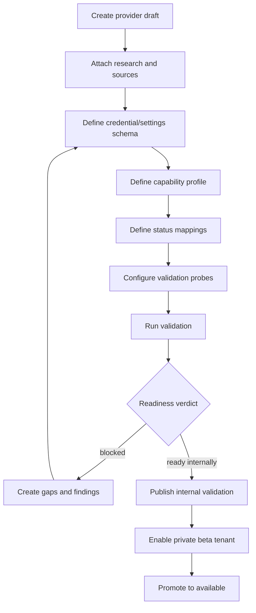
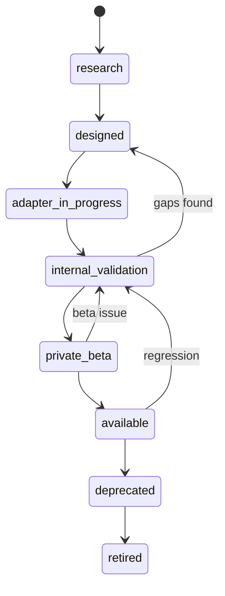

# Provider Integration Studio — Design Document

- **Date:** 2026-05-17
- **Status:** Draft for review
- **Scope:** internal OpenOMS platform-admin tool for preparing, validating, and publishing provider integrations.
- **Related documents:** `../plans/2026-05-21-ope-420-provider-integration-studio-implementation-plan.md`, `2026-05-21-ope-424-canonical-logistics-state-adr.md`, `2026-05-21-ope-425-orchestration-data-lifecycle.md`, `2026-05-17-supplier-integration-research.md`, `2026-05-17-provider-integration-studio-gap-analysis.md`, `2026-05-17-provider-integration-studio-production-readiness.md`, `2026-05-17-provider-integration-studio-ui-ux-design.md`, `2026-05-17-fulfillment-orchestration-design.md`, `../templates/provider-integration-builder.md`, `../templates/supplier-discovery-pack.md`

## Goal

OpenOMS should have an internal admin-only tool that makes adding integrations repeatable and safe. The tool should help the OpenOMS platform administrator research a provider, define credential/setup fields, validate capabilities, test probes, map statuses, and publish the integration only when the system has enough evidence.

This tool is not for customers. Customers should only see integrations that have been published or privately enabled for their tenant.

## Product Name

Working name: **Provider Integration Studio**.

The name describes the real job: not only "add API key", but design, validate, version, and publish a provider integration.

## Users

| User | Access | Purpose |
| --- | --- | --- |
| OpenOMS platform owner | Full access | Add, validate, publish, deprecate providers |
| OpenOMS engineer | Internal access | Implement adapters, inspect validation failures |
| Support/implementation specialist | Limited internal access | Run probes, review field mappings, inspect evidence |
| Tenant/customer user | No access | Sees only published integrations through normal setup UI |

## Access Model

Provider Integration Studio must use a separate platform-admin authorization layer, not tenant-level RBAC.

Recommended model:

- introduce platform-admin identity independent from tenant roles,
- gate all backend routes with `RequirePlatformAdmin`,
- hide all UI routes from normal dashboard navigation,
- protect the internal route additionally with deployment-level access control when possible,
- audit every platform-admin action.

Platform admin permissions:

| Permission | Meaning |
| --- | --- |
| `providers:read` | View provider definitions and validation history |
| `providers:write` | Edit provider definitions, schemas, mappings |
| `providers:validate` | Run validation probes |
| `providers:publish` | Change publication state |
| `providers:secrets` | Manage internal test credentials |

No tenant user should receive these permissions through normal role management.

## Why This Tool Exists

Without this tool, every integration risks becoming a hand-written exception:

- setup fields drift from adapter requirements,
- capabilities are assumed but not verified,
- unknown statuses are hidden in logs,
- customers see integrations before they are actually ready,
- missing tracking/status support becomes visible only after real orders get stuck,
- provider-specific decisions live in code comments instead of durable configuration.

The Studio should turn each provider into a versioned object with evidence.

## High-Level Flow



## Core Objects

### Provider Definition

Represents a provider family, such as `bigbuy`, `matterhorn`, `btp`, `inpost`, `allegro`, `shopify`, or `malfini`.

Fields:

- provider key,
- display name,
- provider type,
- regions,
- supported business domains,
- publication state,
- latest published version,
- owner,
- source links,
- notes.

### Provider Version

Provider behavior changes over time. Every change to credentials, settings, capabilities, status mappings, validation probes, or setup UI must create a version.

Fields:

- provider ID,
- semantic or date-based version,
- changelog,
- compatibility notes,
- publication state,
- created by,
- published by,
- published at.

### Credential And Settings Schema

Defines fields needed to configure the provider.

Groups:

- secret credentials,
- non-secret settings,
- environment settings,
- sync settings,
- feature toggles,
- provider-specific options.

The same schema should generate:

- admin validation form,
- customer setup form after publication,
- backend validation rules,
- documentation snippet,
- test connection input contract.

### Capability Profile

Declares what the provider version can do.

Example capability domains:

- `supplier.catalog.read`,
- `supplier.price.read`,
- `supplier.availability.read`,
- `supplier.order.preflight`,
- `supplier.order.create`,
- `supplier.order.status.read`,
- `supplier.shipment.notice.read`,
- `supplier.invoice.read`,
- `marketplace.order.pull`,
- `marketplace.order.status.push`,
- `carrier.shipment.create`,
- `carrier.tracking.read`.

Each capability must record:

- support state,
- channel,
- mode,
- freshness,
- required inputs,
- provided outputs,
- evidence,
- validation probe,
- readiness impact.

### Status Mapping Set

Maps raw provider statuses into canonical OpenOMS statuses.

Rules:

- raw status is always stored,
- unknown status creates a mapping gap,
- status mapping has confidence,
- terminal status mapping must be explicit,
- shipment/order/line statuses are separate.

### Validation Probe

A deterministic check run by the platform admin before publication.

Probe types:

- auth check,
- endpoint reachability,
- feed fetch,
- feed parse,
- sample catalog read,
- sample stock read,
- sample price read,
- order preflight,
- sandbox/test order create,
- order status read,
- shipment/tracking read,
- invoice read,
- webhook signature verification,
- malformed payload test,
- rate limit behavior.

### Validation Run

Immutable record of one validation attempt.

Fields:

- provider version,
- environment,
- credentials reference,
- started by,
- started at,
- finished at,
- verdict,
- probe results,
- normalized observations,
- findings,
- safe payload hashes,
- logs/correlation IDs.

### Integration Gap

Operational issue preventing safe publication or full automation.

Gap types:

- missing source documentation,
- missing credential field,
- missing status mapping,
- unsupported capability,
- stale data risk,
- missing tracking,
- missing order preflight,
- ambiguous product identity,
- auth failure,
- provider business error,
- parser failure,
- manual fallback required.

## Backend Design

### Route Group

Admin-only endpoints should live under:

```text
/v1/platform/providers
```

Suggested endpoints:

| Method | Path | Purpose |
| --- | --- | --- |
| `GET` | `/v1/platform/providers` | List provider definitions |
| `POST` | `/v1/platform/providers` | Create provider draft |
| `GET` | `/v1/platform/providers/{id}` | Read provider detail |
| `PATCH` | `/v1/platform/providers/{id}` | Update draft metadata |
| `POST` | `/v1/platform/providers/{id}/versions` | Create provider version |
| `GET` | `/v1/platform/providers/{id}/versions/{version_id}` | Read version |
| `PATCH` | `/v1/platform/providers/{id}/versions/{version_id}/schema` | Update credential/settings schema |
| `PATCH` | `/v1/platform/providers/{id}/versions/{version_id}/capabilities` | Update capability profile |
| `PATCH` | `/v1/platform/providers/{id}/versions/{version_id}/status-mappings` | Update status mappings |
| `POST` | `/v1/platform/providers/{id}/versions/{version_id}/validate` | Run validation probes |
| `GET` | `/v1/platform/providers/{id}/versions/{version_id}/validation-runs` | List validation history |
| `POST` | `/v1/platform/providers/{id}/versions/{version_id}/publish` | Change publication state |
| `POST` | `/v1/platform/providers/{id}/versions/{version_id}/enable-tenant` | Enable private beta for a tenant |

### Services

Recommended backend services:

- `ProviderDefinitionService`
- `ProviderVersionService`
- `ProviderSchemaService`
- `ProviderCapabilityService`
- `ProviderValidationService`
- `ProviderPublicationService`
- `ProviderGapService`

### Repositories

Recommended repositories:

- `provider_definition_repository.go`
- `provider_version_repository.go`
- `provider_schema_repository.go`
- `provider_capability_repository.go`
- `provider_status_mapping_repository.go`
- `provider_validation_repository.go`
- `provider_publication_repository.go`

### Database Tables

Conceptual tables:

| Table | Purpose |
| --- | --- |
| `platform_admins` | Platform admin identity and permissions |
| `provider_definitions` | Provider family metadata |
| `provider_versions` | Versioned provider configuration |
| `provider_field_schemas` | Credential/settings form definitions |
| `provider_capability_profiles` | Capabilities per provider version |
| `provider_status_mappings` | Raw-to-canonical status mappings |
| `provider_validation_probes` | Probe definitions per version |
| `provider_validation_runs` | Immutable validation run headers |
| `provider_validation_results` | Probe-level results |
| `provider_integration_gaps` | Blocking or informational gaps |
| `provider_publication_events` | Publication audit trail |
| `provider_tenant_enables` | Private beta tenant allowlist |

Security notes:

- Platform tables are not tenant-scoped.
- They should not be visible through tenant RLS.
- Internal test credentials must be encrypted like integration credentials.
- Customer credentials remain in tenant-scoped `integrations.credentials`.
- Validation payloads must redact secrets and customer PII.

## UI Design

Route:

```text
/platform/providers
```

This route should not be part of normal customer navigation.

### Views

1. **Provider Registry**
   - provider list,
   - type,
   - publication state,
   - latest version,
   - last validation verdict,
   - gaps count,
   - private beta tenants.

2. **Provider Overview**
   - identity,
   - source links,
   - version history,
   - publication state,
   - warnings and blockers.

3. **Schema Builder**
   - credential fields,
   - settings fields,
   - validation rules,
   - environment modes,
   - customer-facing labels,
   - admin-only fields.

4. **Capability Matrix**
   - table of capabilities,
   - support state,
   - channel,
   - freshness,
   - evidence,
   - readiness impact.

5. **Status Mapping**
   - raw statuses,
   - canonical statuses,
   - confidence,
   - unknown mappings,
   - terminal flags.

6. **Validation Runner**
   - select environment,
   - enter/use internal test credentials,
   - run selected probes,
   - show pass/fail/blocked,
   - show safe evidence and gaps.

7. **Publication Panel**
   - state transitions,
   - private beta tenant enablement,
   - promotion checklist,
   - deprecate/retire actions.

## Validator Behavior

The validator should not only test connectivity. It should answer: "Can this provider safely be used for the intended OpenOMS workflow?"

## Production-Ready Decision Matrix

Every provider request must be classified before implementation. The classification decides whether OpenOMS builds a core adapter, a certified custom adapter, a feed/manual workflow, or rejects the integration until the provider/customer can supply missing information.

| Decision | Use when | Required evidence | Customer visibility |
| --- | --- | --- | --- |
| `core_adapter` | Provider is broadly useful, has stable documented APIs or standards, and supports at least one complete OpenOMS workflow | Public or partner docs, test credentials, verified probes, status/error mapping, maintenance owner | Available after validation and publication |
| `certified_custom_adapter` | Provider is important for one or few tenants but still requires production-quality support | Partner spec, tenant/account contract, dedicated owner, tenant-specific capability profile, rollback path | Private beta or selected tenants |
| `feed_managed_provider` | Provider reliably exposes catalog/price/stock but does not support full order/status automation | Feed spec, parser validation, freshness policy, manual order/status fallback | Available as catalog/stock integration only |
| `manual_assisted_provider` | Provider has portal/email/manual process but business value justifies orchestration | Manual task workflow, SLA, evidence capture, operator runbook, dashboard blockers | Available only where manual workflow is explicitly enabled |
| `external_automation_connector` | Provider-specific workflow belongs outside OpenOMS core but must still report state back | Signed webhook/callback contract, idempotency, audit trail, capability limitations | Selected tenants, never as silent core behavior |
| `blocked_provider` | Critical capabilities are unknown, unsafe, legally restricted, untestable, or impossible to operate | Blocking gaps with owner and required remediation | Hidden |

Core rule: a provider can be valuable without being fully automatic. It must never be presented as more capable than the evidence proves.

## Production Readiness Model

Provider readiness is not a single boolean. The Studio should compute and display readiness across independent domains, while publication gates remain strict.

| Domain | Required for customer publication | Blocks publication when |
| --- | --- | --- |
| Identity and scope | Provider key, region, version, owner, source links | Provider identity or environment is ambiguous |
| Credentials and setup schema | Secret/non-secret field split, validation rules, environment modes | Adapter requires a field that schema does not define |
| Security | Encrypted secrets, redaction, SSRF-safe fetches, audit log, platform-admin gate | Secrets can leak to logs/UI/prompts or arbitrary URL fetch is unguarded |
| Capability profile | Every relevant capability is classified and tied to evidence | Critical workflow capability remains `unknown` |
| Data freshness | Stock, price, status, tracking freshness rules are explicit | Automation depends on data without freshness guarantees |
| Status mapping | Raw statuses mapped by domain and confidence | Terminal/blocking raw status is unmapped |
| Error mapping | Auth, business, transport, parser, rate-limit errors are typed | Provider errors collapse into generic failure only |
| Validation probes | Deterministic probes exist for supported capabilities | A published capability has no validation probe |
| Evidence | Safe observation/evidence is stored for probes and runtime behavior | No audit path exists to explain provider decisions |
| Tenant account verification | Tenant-specific probes can downgrade default capabilities | Provider default capability is assumed for every tenant account |
| Operations | Runbook, owner, deprecation path, incident process | No owner or disable/rollback path exists |

Readiness states:

- `blocked` — cannot be implemented or published until blocking gaps are resolved.
- `implementation_ready` — enough facts exist to build adapter code.
- `internal_validation_ready` — adapter exists and can be validated by OpenOMS admins.
- `private_beta_ready` — selected tenant can use it under explicit monitoring.
- `customer_publish_ready` — customer-visible publication is allowed.
- `deprecated` — still supported for existing tenants, hidden for new setup.
- `retired` — disabled after migration or provider shutdown.

The UI may show percentage-like progress per domain, but publication must use gate conditions. A 90% provider with one unmapped terminal status is still blocked for customer publication.

### Readiness Verdicts

| Verdict | Meaning |
| --- | --- |
| `blocked` | Missing required fields, unsupported critical capability, auth failure, parse failure, or unmapped critical status |
| `ready_for_implementation` | Research/schema/capabilities are coherent; code may be built |
| `ready_for_internal_validation` | Adapter exists and can run platform-admin probes |
| `ready_for_private_beta` | Probes pass; selected tenant may test |
| `ready_for_customer_publish` | E2E workflow and operational safeguards are verified |

### Blocking Conditions

The validator should block publication when:

- credential schema is incomplete,
- setup fields do not match adapter requirements,
- critical capability is `unknown`,
- automatic action lacks error mapping,
- provider status list has unmapped terminal or blocking statuses,
- stock/price freshness is undefined for automation that depends on it,
- auth check fails,
- feed/parser probe fails,
- order create is enabled but idempotency or duplicate handling is undefined,
- tracking push is enabled but shipment/tracking capability is not verified,
- evidence storage is disabled.

## Evidence And Retention Policy

Evidence must be useful for debugging and audit without storing unnecessary secrets or customer personal data.

| Evidence type | Store | Redact or hash | Suggested retention |
| --- | --- | --- | --- |
| Auth probe result | status, provider account ID when safe, scopes/permissions | tokens, secrets, refresh tokens | 180 days |
| API response metadata | endpoint key, status code, provider request ID, duration, normalized fields | raw credentials, PII, full response body unless explicitly safe | 180 days |
| Feed snapshot | URL host/path hash, checksum, row count, parser version, duration | query tokens, signed URLs, raw file content by default | 180 days |
| Status observation | raw status, canonical mapping, confidence, source timestamp | customer PII from raw payload | order retention policy |
| Validation log | probe ID, result, safe error class, correlation ID | request/response bodies with secrets or PII | 180 days |
| Manual confirmation | actor, timestamp, entered reference, attachment metadata | secret attachments unless explicitly classified | order retention policy |
| Provider document reference | source URL, document title, version, review date | partner-confidential content unless approved storage exists | while provider version is active |

Rules:

- Store raw payloads only when a field-level redaction policy exists for that provider version.
- Store safe payload hashes for correlation even when raw payload is not stored.
- Never send credentials, customer PII, or partner-confidential payloads into AI prompts.
- Evidence must link to provider version, tenant integration when applicable, validation run, and OpenOMS actor/system process.
- Deleting or rotating credentials must not delete historical non-secret evidence.

## Operational Runbooks

Provider Integration Studio must ship with operational runbooks, because provider drift is guaranteed.

| Scenario | Required runbook response |
| --- | --- |
| Provider changes API response format | Freeze publication promotion, create parser gap, run compatibility probes, publish fixed provider version |
| Provider auth starts failing | Mark affected validation/tenant integrations as auth error, suppress retry storm, instruct reconnect/recredential flow |
| Feed is stale | Downgrade stock/price capability, block dependent automation, surface dashboard problem |
| Unknown status appears | Store raw status, create mapping gap, block automatic transition, require admin mapping decision |
| Tracking missing past SLA | Create shipment/tracking blocker, decide manual follow-up vs provider issue |
| Provider rate limits OpenOMS | Apply provider-level backoff, record rate-limit budget, pause non-critical probes |
| Provider returns business rejection | Preserve rejection reason, map to actionable blocker, avoid blind retries |
| Provider outage | Mark provider health degraded, pause destructive actions, keep polling status checks within backoff limits |
| Provider deprecates endpoint | Create replacement provider version, migrate tenants, deprecate old version |
| Credential leak suspicion | Revoke/rotate credentials, invalidate internal test credentials, audit access, review evidence redaction |

Each runbook entry must identify:

- detection signal,
- immediate system behavior,
- human owner,
- customer impact,
- recovery action,
- audit/evidence required,
- rollback or disable path.

## RACI And Ownership

Provider lifecycle must have explicit ownership.

| Activity | Platform owner | Engineer | Support/implementation | Security owner | Customer |
| --- | --- | --- | --- | --- | --- |
| Provider research | Accountable | Consulted | Responsible when customer-specific | Consulted for sensitive providers | Consulted |
| Capability classification | Accountable | Responsible | Consulted | Consulted | Informed |
| Credential/schema design | Accountable | Responsible | Consulted | Consulted | Informed |
| Adapter implementation | Informed | Accountable/Responsible | Consulted | Consulted | Not involved |
| Validation probes | Accountable | Responsible | Responsible for partner credentials | Consulted | Not involved unless tenant-specific |
| Publication decision | Accountable | Consulted | Consulted | Consulted | Informed |
| Incident handling | Accountable | Responsible for code/provider issue | Responsible for customer comms | Consulted for leak/security issue | Informed |
| Deprecation/retirement | Accountable | Responsible for migration tools | Responsible for tenant migration | Consulted | Informed |

No provider may be customer-visible without an accountable platform owner and an operational owner.

## Existing Provider Migration Policy

Existing integrations must be migrated into the Studio model instead of leaving two parallel truths.

Migration sequence per provider:

1. Create provider definition and version matching current code behavior.
2. Register current credential/settings schema from actual dashboard/backend fields.
3. Classify implemented capabilities from code, not marketing intent.
4. Import current readiness from `provider-info.ts`, `readiness.ts`, and `integration-status.ts` as historical metadata.
5. Add validation probes that cover existing behavior.
6. Run validation against internal or approved test accounts.
7. Link tenant integrations to provider version.
8. Enable tenant-specific capability downgrades.
9. Replace static frontend provider readiness with API-driven publication state.
10. Keep old static maps only as fallback until all active providers are migrated.

Initial migration and proof candidates must be class-first. The concrete provider is a representative of a capability class; it must not become a hard-coded architectural boundary.

| Capability class | Initial representative | Reason |
| --- | --- | --- |
| Marketplace platform | Allegro | Broad marketplace surface and already customer-relevant; must produce reusable marketplace auth/order/status/publication patterns |
| Carrier network | InPost | Carrier with labels, tracking, pickup points and strong production relevance; must produce reusable carrier probe and evidence patterns |
| Hybrid supplier feed/API | BTP | Supplier integration proving feed/API split, known missing status/tracking capabilities and generated setup requirements |
| Carrier expansion | GLS/DPD/DHL | Follow-on carrier representatives for status mapping variance after carrier class foundations are proven |
| Invoice provider | Fakturownia | Separate accounting/invoice capability class with its own credential, document and status semantics |
| Hosted/self-hosted shop | Shopify/WooCommerce/Shoper | Shop representatives for versioned APIs, webhooks, self-hosted URL safety and publication readiness gaps |

### Generated Setup Fields

The Studio should generate tenant setup fields from the provider schema:

- field label,
- type,
- required flag,
- secret/non-secret storage target,
- environment visibility,
- validation rules,
- help text,
- capability enabled by this field,
- test connection dependency.

This avoids hand-written mismatches between UI forms and backend adapter requirements.

## Publication Flow



## Integration With Tenant Setup

Published provider versions should feed the normal tenant integration setup:

- customer sees only `available` providers,
- selected tenants can see `private_beta` providers,
- setup form is generated from `provider_field_schemas`,
- test connection calls the provider version's validation probe,
- created tenant integration stores credentials/settings using the approved schema,
- initial tenant capability profile is copied from provider defaults,
- tenant-specific probes can downgrade capabilities if account access differs from provider defaults.

This last point is important: a provider version may generally support tracking, but a specific tenant account may not have the permission enabled. Tenant integration readiness must be verified separately.

## Observability

Each validation run should produce:

- structured logs with provider/version/probe/correlation ID,
- validation result rows,
- safe payload hashes,
- redacted error details,
- metrics per probe type and provider,
- audit log entry for platform-admin action.

Metrics:

- `provider_validation_runs_total`,
- `provider_validation_probe_duration_seconds`,
- `provider_validation_probe_failures_total`,
- `provider_publication_state_changes_total`,
- `provider_integration_gaps_open_total`.

## Security And Privacy

Rules:

- No platform admin pages for tenant users.
- No secrets in logs, payload samples, validation findings, or AI prompts.
- Internal test credentials encrypted at rest.
- Customer credentials tenant-scoped and encrypted separately.
- Provider source documents may contain partner-confidential material and should not be exposed to customers.
- Validation payload samples must be redacted before storage.
- Publication requires audit trail.
- Dangerous actions, such as production order create probes, require explicit confirmation and should prefer sandbox/test mode.

## Threat Model

Provider Integration Studio has a higher risk profile than normal tenant settings because it can define provider fields, run probes, store internal test credentials, influence customer-visible setup, and publish integrations.

| Threat | Risk | Required control |
| --- | --- | --- |
| Tenant user reaches platform admin route | Cross-tenant/provider metadata exposure or unauthorized publication | Separate platform-admin auth, backend middleware, frontend route isolation, deployment-level access control where possible |
| Provider credentials leak through logs/evidence | Account takeover or provider abuse | Secret field classification, log redaction, encrypted storage, evidence policy, no raw prompt sharing |
| SSRF through feed/API validation | Internal network metadata exposure | Safe HTTP client, DNS/IP private range blocking, host allowlists for published providers, bounded redirects |
| Malicious provider payload | Parser crash, memory pressure, unsafe HTML/file handling | Bounded reads, size limits, schema validation, safe HTML sanitization, parser timeouts |
| Incorrect status mapping | Wrong order transitions, accidental customer/marketplace updates | Mapping confidence, unknown-status blockers, terminal status gates, validation samples |
| Publishing unverified capability | Customer workflow failure at runtime | Publication gates, validation probes, capability evidence, tenant-specific downgrades |
| Probe creates real production order | Financial/operational side effect | Sandbox default, explicit destructive-probe confirmation, idempotency key, production probe audit |
| AI research receives secrets or PII | Third-party exposure | Keep AI workflow external, use redacted briefs only, block credentials/raw customer payloads |
| Partner-confidential docs exposed to customers | Contract breach | Store redacted summaries only until confidential storage policy exists, customer UI never links internal docs |
| Platform admin account compromise | Provider publication and credential impact | Strong 2FA, audit, least privilege, permission separation, sensitive action confirmation |

Security review is mandatory before customer publication of Provider Integration Studio itself.

## Relationship To Existing OpenOMS Code

Current OpenOMS already has:

- tenant-scoped `integrations`,
- encrypted credentials,
- supplier provider interfaces,
- carrier provider interfaces,
- marketplace provider packages,
- worker infrastructure,
- audit log,
- dashboard setup surfaces.

The Studio should build on these patterns, but it should introduce platform-level provider definitions instead of forcing every provider decision into tenant-specific records.

Current `SupplierProvider` is intentionally too narrow for this future state. The Studio should drive expansion through optional interfaces and verified capability profiles, not one large provider interface.

## Rollout Strategy

1. Build platform-admin auth gate and read-only provider registry.
2. Add provider definitions and versions.
3. Add schema builder and generated setup-field preview.
4. Add capability matrix and status mapping.
5. Add validation probes for existing simple providers.
6. Connect publication states to tenant setup visibility.
7. Add private beta tenant enablement.
8. Migrate selected existing providers into the registry.
9. Require registry entry for all new provider work.

## Implementation Defaults

Use these defaults for the first implementation:

1. Platform-admin identity uses a separate `platform_admins` table and `RequirePlatformAdmin` middleware. It is not modeled as a tenant role.
2. Confidential provider documents are not stored in the first pass. The Studio stores source links, redacted summaries, and provider metadata.
3. AI-assisted research stays outside the product and uses `provider-integration-builder.md` until prompt/privacy boundaries are mature.
4. Short probes such as auth and metadata checks may run synchronously. Feed parsing, order probes, and long provider checks run asynchronously through workers.
5. Internal test credentials are encrypted and separated from customer tenant credentials.
6. Customer-visible provider setup is generated only from a published provider version.

## Self-Review

- The Studio is explicitly internal/admin-only and not customer-facing.
- Tenant RBAC is not reused for platform admin rights.
- Provider definitions are versioned.
- Capability, schema, status mapping, validation, evidence, and publication are separate objects.
- The validator checks readiness, not just connectivity.
- Customer setup fields are generated from approved schemas.
- Tenant-specific capability downgrades are allowed because provider defaults may not match every account.
- No provider capability is assumed from provider name alone.
