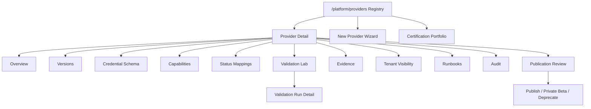

# Provider Integration Studio — UI/UX Design Specification

- **Data:** 2026-05-17
- **Status:** docelowa definicja UI/UX do review
- **Zakres:** wewnętrzny panel platform-admin dla projektowania, walidacji, publikacji i utrzymania integracji providerów.
- **Powiązane dokumenty:** `2026-05-17-provider-integration-studio-design.md`, `2026-05-17-provider-integration-studio-production-readiness.md`, `2026-05-17-provider-integration-studio-gap-analysis.md`, `2026-05-17-supplier-integration-research.md`, `../templates/provider-integration-builder.md`

## Cel UI/UX

Provider Integration Studio ma być narzędziem operacyjnym dla OpenOMS, nie kreatorem marketingowym ani prostym formularzem "dodaj API key". Interfejs ma pomagać platform-adminowi przejść od researchu providera do bezpiecznej publikacji wersjonowanej integracji, z pełną widocznością braków, dowodów, ryzyk i statusu gotowości.

Najważniejszy cel doświadczenia:

- administrator widzi, które integracje są gotowe, zablokowane, prywatnie włączone albo wymagają pracy,
- każda decyzja publikacyjna jest oparta o walidację i evidence,
- nie da się przypadkowo pokazać klientowi integracji bez spełnionych gate'ów,
- brakujące capability, nieznany status, brak trackingu albo ręczny fallback są widoczne jako normalny stan systemu, nie jako ukryty błąd,
- workflow jest szybki dla doświadczonego operatora, ale bezpieczny dla czynności ryzykownych.

## Kontekst Produktowy

Studio jest dostępne tylko dla OpenOMS platform-adminów. Nie jest częścią tenantowego panelu klienta i nie może korzystać z tenantowego `AdminGuard` jako jedynej ochrony. Frontend może używać istniejącego dashboard shellu, ale widoczność, routing i API muszą być oddzielone przez platform-admin auth.

Docelowa ścieżka:

```text
/platform/providers
```

Nie dodawać tej sekcji do zwykłego tenantowego sidebaru. Dostęp powinien być przez:

- bezpośredni URL dla platform-admina,
- osobny platform switcher w headerze widoczny tylko dla platform-admina,
- Command Palette filtrowaną po uprawnieniu platform-admin.

## Zasady Projektowe

| Zasada | Decyzja UI/UX |
| --- | --- |
| Operacyjność przed dekoracją | Gęste, czytelne widoki tabelaryczne; mało ozdobników; statusy i akcje są ważniejsze niż duże ilustracje |
| Evidence-first | Każde capability, mapping i gate pokazuje źródło dowodu albo jawny brak dowodu |
| Progressive disclosure | Registry pokazuje stan ogólny; szczegóły walidacji, payloadów i runbooków są w tabach/drawerach |
| Bezpieczna publikacja | Publish jest osobnym review flow, nie zwykłym przyciskiem na formularzu |
| Jawne braki | `unknown`, `manual_supported`, `partially_supported` i `not_supported` mają osobne stany wizualne |
| Brak magii | AI/research może zasilać szkic, ale UI wymaga review, evidence i redakcji przed użyciem |
| Stabilna praca | Autosave draftów, brak utraty danych przy przejściu między sekcjami, widoczny stan zapisania |
| Zgodność z OpenOMS | Użyć istniejących tokenów, komponentów shadcn/ui, lucide icons, `PageHeader`, `Surface`, `StatusBadge`, `ProviderLogo`, `FormWrapper` |

## Architektura Informacji



Główne obszary:

- **Provider Registry** — lista providerów, ich wersji, gotowości, ownerów i blockerów.
- **Provider Detail** — centrum pracy nad jedną rodziną providera.
- **Version Workspace** — porównanie i edycja wersji providera.
- **Schema Builder** — pola credentials/settings oraz preview tenantowego formularza.
- **Capability Matrix** — deklarowany i zweryfikowany zakres możliwości.
- **Status Mapping Workbench** — raw statuses, canonical mapping, unknown gaps.
- **Validation Lab** — uruchamianie probe'ów, wyników i evidence.
- **Publication Review** — gate'y produkcyjne i decyzje widoczności.
- **Certification Portfolio** — przegląd proofów klas integracji i reprezentatywnych certyfikacji providerów.
- **Tenant Visibility** — private beta, allowlisty i tenant-specific downgrades.

## Nawigacja

### Platform Entry

W headerze dashboardu platform-admin widzi kompaktowy przełącznik:

```text
OpenOMS tenant context  |  Platform
```

Zasady:

- przełącznik nie jest widoczny dla tenant owner/admin/member,
- wejście do platformy nie zmienia aktywnego tenant contextu,
- breadcrumbs pokazują wyraźnie `Platform / Providers / BigBuy`,
- Command Palette pokazuje akcje platformowe tylko w platform context.

### Platform Sidebar

Nie tworzyć pełnego drugiego, rozbudowanego menu. Wystarczy wąska sekcja platformowa:

- Providers,
- Certification,
- Validation Runs,
- Publication Events,
- Platform Audit.

Na mobile menu platformowe jest w `Sheet`, ale Studio jest projektowane przede wszystkim do pracy desktopowej. Mobile musi działać do odczytu i awaryjnych decyzji, lecz ciężkie edycje schema/mappingów są desktop-first.

## Screen 1: Provider Registry

Cel: szybka odpowiedź na pytania "co mamy", "co jest gotowe", "co blokuje publikację" i "czym teraz trzeba się zająć".

Layout:

- `PageHeader` z tytułem `Provider Integration Studio`.
- Akcje: `New provider`, `Import existing provider`, `Run certification suite`.
- Kompaktowy metric strip, nie karty w kartach:
  - `Available`,
  - `Private beta`,
  - `Blocked`,
  - `Needs validation`,
  - `Deprecated`.
- Filter bar:
  - search,
  - provider type,
  - lifecycle state,
  - readiness verdict,
  - owner,
  - region,
  - capability domain,
  - blocker severity.
- Data table.

Kolumny tabeli:

| Column | Content |
| --- | --- |
| Provider | `ProviderLogo`, name, provider key |
| Type | marketplace, carrier, supplier, shop, invoicing, EDI profile |
| Lifecycle | status badge + latest transition date |
| Latest version | version, published/draft marker |
| Readiness | verdict: ready, needs review, blocked, degraded |
| Blockers | count by severity; click opens filtered gaps |
| Capabilities | compact coverage summary: supported/partial/manual/unknown |
| Last validation | timestamp, environment, result |
| Owner | person/team |
| Visibility | internal/private beta/available/deprecated |

Row click opens Provider Detail. Row actions are in an overflow menu:

- Open,
- Create new version,
- Run validation,
- Publication review,
- Emergency disable.

Empty state:

- visible only when registry is truly empty,
- primary action `New provider`,
- secondary action `Import existing provider`.

## Screen 2: New Provider Wizard

Cel: ustandaryzować tworzenie providerów tak, aby już na początku powstał kompletny szkic do walidacji.

Stepper:

1. Basics
2. Source docs
3. Credential schema
4. Capability profile
5. Status mappings
6. Validation probes
7. Review

Zasady UX:

- autosave draft po każdej sekcji,
- `Save draft` i `Continue` są oddzielne,
- można wrócić do poprzedniego kroku bez utraty danych,
- walidacja inline na blur,
- review pokazuje kompletność i braki, nie tylko podsumowanie formularza,
- pierwszy ekran nie wymaga pełnej konfiguracji providera; wymaga tylko danych potrzebnych do stworzenia draftu.

Wizualnie:

- lewy sticky stepper na desktop,
- główna kolumna formularza,
- prawy panel `Readiness preview` pokazujący braki powstające podczas konfiguracji.

## Screen 3: Provider Detail Overview

Cel: jedno miejsce, w którym operator rozumie stan providera bez wchodzenia w każdy szczegół.

Layout:

- `PageHeader`:
  - `ProviderLogo`,
  - provider name,
  - provider key,
  - lifecycle badge,
  - latest version,
  - owner.
- Akcje:
  - `Run validation`,
  - `Create version`,
  - `Publication review`,
  - overflow: `Deprecate`, `Retire`, `Emergency disable`.
- `DetailLayout`:
  - main: overview + tabs,
  - sidebar: readiness, blockers, visibility, last validation, owner.

Tabs:

- Overview,
- Versions,
- Schema,
- Capabilities,
- Status mappings,
- Validation,
- Evidence,
- Tenants,
- Runbooks,
- Audit.

Overview sections:

- lifecycle timeline,
- readiness verdict,
- top blockers,
- capability coverage,
- recent validation runs,
- publication history,
- tenant impact summary.

## Screen 4: Version Workspace

Cel: każda zmiana w providerze jest wersjonowana i porównywalna.

Widok:

- lista wersji w tabeli,
- status: draft/internal/private beta/available/deprecated/retired,
- changelog,
- created by / published by,
- compatibility notes,
- linked tenant count,
- validation verdict.

Wersja draft:

- edytowalna,
- ma widoczny stan autosave,
- może być porównana z ostatnią opublikowaną wersją.

Wersja published:

- read-only,
- akcje modyfikujące są niedostępne,
- zmiana wymaga `Create new version`.

Version diff:

- sekcje: fields, capabilities, status mappings, probes, publication gates,
- zmiany oznaczone jako added/changed/removed,
- breaking changes mają osobny warning i wymagają compatibility note.

## Screen 5: Credential And Settings Schema Builder

Cel: budować konfigurację providera jako strukturalny schema, nie jako ręczny JSON.

Układ:

- tabela/lista pól po lewej,
- edytor właściwości pola po prawej,
- preview tenantowego setup formu na dole albo w drawerze.

Field properties:

| Property | UX control |
| --- | --- |
| Label | text input |
| Key | generated slug with manual edit before publication |
| Type | select: text, password, token, url, number, boolean, select, multiselect, json, file |
| Required | switch |
| Secret | switch with warning when disabled for sensitive names |
| Environment | segmented control: sandbox, production, both |
| Validation | structured rule editor |
| Visibility | conditional rule editor |
| Tenant help text | textarea |
| Internal note | textarea, never customer-visible |
| Adapter binding | select from adapter-required inputs |

Zasady:

- secret fields nigdy nie mają preview raw value,
- dla self-hosted URL pokazujemy SSRF/privacy warning i wynik walidacji hosta,
- adapter-required field bez schema field tworzy blocking gap,
- usunięcie published field jest breaking change i wymaga nowej wersji oraz review.

Tenant setup preview:

- pokazuje tylko customer-visible labels/help text,
- wyraźnie odróżnia secret i non-secret,
- pokazuje dynamic visibility,
- pozwala sprawdzić mobile wrapping długich labeli.

## Screen 6: Capability Matrix

Cel: nie zgadywać, co provider potrafi. Każda capability ma stan, kanał, tryb, świeżość i dowód.

Widok:

- tabela matrix z grupowaniem po domenie:
  - supplier,
  - marketplace,
  - carrier,
  - shop,
  - invoicing,
  - EDI.
- filtr po support state i gap severity.
- inline details w rozwijanym row, nie osobny modal dla każdej capability.

Kolumny:

- Capability,
- Support state,
- Channel,
- Mode,
- Freshness,
- Required inputs,
- Provided outputs,
- Evidence,
- Validation probe,
- Customer visibility.

Support states:

| State | Tone | Meaning |
| --- | --- | --- |
| supported | emerald | zweryfikowane i automatyzowalne |
| partially_supported | amber | działa w ograniczonym zakresie |
| manual_supported | blue/slate | wymaga ręcznego procesu, ale jest obsługiwalne |
| not_supported | slate | provider nie daje tej możliwości |
| unknown | red/amber | brak dowodu; blokuje publikację jeśli capability jest wymagana |

Nie przekazywać znaczenia tylko kolorem. Każdy badge ma label i tooltip.

## Screen 7: Status Mapping Workbench

Cel: obsłużyć różne statusy providerów bez cichego mapowania błędów na sukces.

Widok:

- tabs domenowe:
  - Order,
  - Order line,
  - Shipment,
  - Package,
  - Invoice,
  - Return.
- dwukolumnowy układ:
  - left: observed raw statuses,
  - right: canonical mapping rules.
- unknown gaps inbox na górze.

Mapping row:

- raw status,
- raw source,
- canonical status,
- confidence,
- terminal flag,
- automation blocking flag,
- evidence link,
- first seen / last seen,
- validation run reference.

Interakcje:

- `Map selected` dla wielu raw statusów,
- `Mark as unknown gap`,
- `Require manual review`,
- warning przy terminal status z niskim confidence,
- warning gdy shipment status próbuje zmienić commercial order status.

## Screen 8: Validation Lab

Cel: uruchamiać bezpieczne, powtarzalne probe'y i widzieć wyniki bez grzebania w logach.

Layout:

- left: probe selection,
- center: run progress and results,
- right: environment, credentials profile, safety notes.

Probe groups:

- Authentication,
- Connectivity,
- Catalog,
- Price,
- Stock,
- Order preflight,
- Test order,
- Status read,
- Tracking,
- Invoice,
- Webhook,
- Rate limit,
- Malformed payload.

Safety levels:

| Level | Meaning | UX |
| --- | --- | --- |
| read_only | does not mutate provider state | normal primary action |
| sandbox_write | mutates sandbox/test environment | requires confirmation |
| production_write | mutates production provider state | disabled by default; requires explicit permission and confirmation |
| destructive | cancels/deletes/irreversible | separate danger flow; never part of default suite |

Run result:

- overall verdict,
- per-probe result,
- duration,
- provider request IDs,
- safe payload hash,
- redacted sample,
- generated gaps,
- retry/rerun failed actions.

Background validation:

- running state remains visible after navigation,
- toast only informs that run finished,
- full result lives in Validation Runs.

## Screen 9: Publication Review

Cel: publikacja jest świadomą decyzją, nie efektem zapisu formularza.

Review layout:

- gate checklist `G1-G9`,
- blocking gaps,
- warning gaps,
- last successful validation,
- capability changes,
- schema changes,
- status mapping changes,
- tenant impact,
- rollback target,
- runbook links.

Actions:

- `Publish internal validation`,
- `Enable private beta`,
- `Promote to available`,
- `Deprecate`,
- `Retire`,
- `Emergency disable`.

Zasady:

- primary action jest dostępna tylko, gdy gate'y pozwalają na dany transition,
- disabled action pokazuje konkretne powody,
- publikacja wymaga confirmation dialog z krótkim summary skutków,
- emergency disable jest zawsze dostępne dla uprawnionych, ale wymaga wpisania reason.

## Screen 10: Tenant Visibility

Cel: platform admin widzi, komu integracja jest dostępna i czy tenant ma downgrade capability.

Sekcje:

- Public availability,
- Private beta allowlist,
- Tenant-specific capabilities,
- Tenant validation runs,
- Tenant setup health,
- Emergency disable scope.

Tabela tenantów:

- tenant,
- visibility state,
- provider version,
- configured credentials state,
- tenant validation verdict,
- capability downgrades,
- last sync/last validation,
- active blockers.

Akcje:

- enable private beta,
- remove from beta,
- force revalidation,
- view tenant setup health,
- disable provider for tenant.

## Screen 11: Evidence And Audit

Cel: umożliwić review i incident response bez ekspozycji sekretów/PII.

Evidence view:

- immutable timeline,
- filters by version, validation run, probe, severity, actor,
- redacted payload preview,
- payload hash,
- source URL/reference,
- retention date,
- viewer permissions.

Audit view:

- actor,
- action,
- object,
- before/after summary,
- timestamp,
- IP/session metadata where available,
- linked publication/validation event.

Zasady:

- raw secrets nigdy nie są renderowane,
- payload preview jest redacted by default,
- dostęp do sensitive evidence wymaga `providers:secrets` albo osobnego uprawnienia evidence-view,
- eksport evidence jest osobnym audytowanym flow.

## Screen 12: Certification Portfolio

Cel: kontrolować proofy klas integracji i dopiero potem certyfikować konkretne firmy jako reprezentantów tych klas.

Widok:

- tabela/board z klasami integracji,
- reprezentatywny provider lub profil przypisany do klasy,
- class proof state,
- provider certification state,
- reusable artifact checklist,
- blocker summary dla klasy i providera,
- next action,
- owner.

Board rows:

| Capability class | Representative shown in UI | Class proof state |
| --- | --- | --- |
| Marketplace OAuth/order import | Allegro | Not started / in validation / class proven / blocked |
| Carrier label/tracking/pickup points | InPost | Not started / in validation / class proven / blocked |
| Supplier hybrid feed/API | BTP.pro | Not started / in validation / class proven / blocked |
| Full dropshipping API | BigBuy | Not started / in validation / class proven / blocked |
| Account/region capability variance | Matterhorn | Not started / in validation / class proven / blocked |
| SOAP/XML B2B | MALFINI | Not started / in validation / class proven / blocked |
| Hosted shop webhooks/API versioning | Shopify | Not started / in validation / class proven / blocked |
| Self-hosted REST variability | WooCommerce | Not started / in validation / class proven / blocked |
| Enterprise connector governance | TD SYNNEX | Not started / in validation / class proven / blocked |
| EDI business documents | GS1 EANCOM profile | Not started / in validation / class proven / blocked |

Każdy wiersz klasy pokazuje:

- required capabilities,
- representative provider version,
- validation runs,
- required reusable artifacts,
- provider-specific gaps,
- blockers preventing class proof,
- next provider candidates for the same class.

UI rule:

- Nie wolno pokazać klasy jako proven tylko dlatego, że jeden provider działa end-to-end.
- Klasa jest proven dopiero wtedy, gdy powstały reusable schema, status mapping, validation probe set, evidence pattern, runbook pattern i tenant visibility rules.
- Provider może być certified within class, ale nadal mieć jawne gaps, które są widoczne w setupie klienta.

## Tenant-Facing Generated Setup

Studio nie jest widoczne dla klientów, ale jego published schema zasila customer setup forms.

Customer UI musi:

- pokazywać tylko `available` albo private-beta-enabled provider versions,
- generować formularz z published schema,
- nie pokazywać internal notes, evidence ani validation probes,
- jasno oznaczać capabilities manual/partial/not supported,
- blokować setup, gdy provider jest emergency-disabled,
- pokazywać recovery path przy błędach credentials/test connection.

Nie wolno:

- renderować draft providerów,
- pokazywać customerowi `unknown` jako supported,
- ukrywać manual fallbacku za ogólnym komunikatem błędu.

## Interaction Model

### Save And Edit

- Drafty autosave'ują się z widocznym stanem: saving/saved/error.
- Published versions są read-only.
- Modyfikacja published config wymaga stworzenia nowej wersji.
- Zmiana breaking field/status/capability wymaga compatibility note.

### Feedback

- Inline validation pod polem.
- Error summary na górze długich formularzy.
- Toast tylko dla krótkiego potwierdzenia; szczegóły błędu są w kontekście formularza albo run detail.
- Długie operacje pokazują progress i można wrócić do wyniku później.

### Dangerous Actions

- Publish/deprecate/retire/emergency disable używają `ActionDialog`.
- Destructive actions wymagają reason.
- Produkcyjny probe write jest opt-in i nie pojawia się w default validation suite.
- Anulowanie dialogu nie traci niezapisanych danych.

### Keyboard And Command Palette

Wspierane akcje:

- open provider by search,
- create provider,
- run validation for current provider,
- open blockers,
- open last validation run,
- open publication review.

Skróty nie mogą być jedyną drogą do akcji.

## Visual System

Provider Integration Studio ma wyglądać jak naturalna część OpenOMS dashboardu:

- używać istniejącego `dashboard-base`, tokenów `background`, `card`, `muted`, `border`, `info`, `success`, `warning`, `destructive`,
- używać Geist Sans/Mono z obecnego projektu,
- Page H1: istniejące `text-2xl font-semibold`,
- panel headings: `text-base font-semibold`,
- body/dashboard copy: 14px zgodnie z `dashboard-base`,
- radius zgodny z obecnym systemem; nowe powierzchnie maksymalnie `rounded-lg`,
- lucide-react jako jedyny zestaw ikon,
- żadnych dekoracyjnych gradientów, orbów, hero layoutów ani ilustracji,
- żadnych kart w kartach; sekcje jako `Surface`, tabele, listy, sticky sidebars i full-width bands.

Status color rules:

| Domain | Tone |
| --- | --- |
| ready/available/supported | emerald/success |
| validation running/pending | info |
| partial/manual/review needed | amber/warning or muted + label |
| blocked/error/unknown required mapping | destructive |
| deprecated/retired/not supported | muted/slate |

Kolor nigdy nie jest jedynym nośnikiem znaczenia. Badge zawsze ma tekst, a icon-only actions mają `aria-label` i tooltip.

## Component Inventory

Reused components:

- `PageHeader`,
- `Surface`,
- `DetailLayout`,
- `SettingsLayout`,
- `FormWrapper`,
- `StatusBadge`,
- `ProviderLogo`,
- `EmptyState`,
- `LoadingSkeleton`,
- `ActionDialog`,
- shadcn `Table`, `Tabs`, `Dialog`, `Sheet`, `Select`, `Switch`, `Textarea`, `Tooltip`, `Progress`.

New components:

| Component | Purpose |
| --- | --- |
| `PlatformAdminGuard` | frontend guard for platform-admin-only pages; backend remains authoritative |
| `PlatformNav` | compact platform navigation separate from tenant sidebar |
| `ProviderRegistryTable` | provider list with filters, sorting, row actions |
| `ProviderReadinessBadge` | consistent readiness verdict display |
| `ProviderLifecycleStepper` | lifecycle state and transition history |
| `ProviderMetricStrip` | compact counts on registry and detail pages |
| `CredentialSchemaBuilder` | structured field/schema editor |
| `TenantSetupPreview` | generated customer form preview |
| `CapabilityMatrix` | grouped capability support table |
| `StatusMappingWorkbench` | raw-to-canonical status mapping UI |
| `ValidationProbeSelector` | validation suite/probe selection |
| `ValidationRunTimeline` | running/completed probe result display |
| `EvidenceDrawer` | redacted evidence preview with hashes and metadata |
| `PublicationChecklist` | gate checklist and transition action surface |
| `TenantVisibilityPanel` | private beta and tenant capability downgrade management |
| `CertificationPortfolioTable` | Capability-class proof coverage and representative provider certification |

## Responsive Behavior

Breakpoints:

- 375px: read-only fallback; heavy matrix/table actions collapse into stacked list rows.
- 768px: two-column forms can collapse into one column; tabs remain horizontal scrollable.
- 1024px: sticky sidebar appears in detail views.
- 1440px: full registry/matrix density.

Rules:

- no horizontal page scroll,
- tables may use internal horizontal scroll only for dense admin matrix views,
- primary actions stay visible above the fold on desktop,
- sticky sidebars must not cover content,
- mobile action bars use full-width buttons with 44px+ height,
- text wraps instead of overflowing badges/buttons.

## Accessibility

Minimum requirements:

- full keyboard navigation for registry, wizard, schema builder, capability matrix and validation run detail,
- visible focus states,
- semantic headings,
- `aria-label` for icon-only buttons,
- `aria-live="polite"` for validation run completion and autosave state,
- no color-only status communication,
- form labels are visible,
- errors appear near fields and in summary for long forms,
- dialog focus is trapped and returns to trigger,
- reduced-motion support for progress/timeline animations,
- touch targets at least 44px for primary mobile controls.

## Loading, Empty, Error And Permission States

Loading:

- registry: table skeleton,
- detail: header skeleton + tab content skeleton,
- validation run: progress/timeline skeleton if result is not loaded.

Empty:

- registry empty: create/import actions,
- no validation runs: action to run first validation,
- no status mappings: action to import observed statuses or add mapping,
- no evidence: explain that evidence appears after validation runs.

Error:

- provider API error: inline alert with retry,
- validation failure: result row with recovery path,
- permission denied: clear platform-admin access message, no sensitive details,
- stale draft conflict: show diff and require choose current/server version.

## Data Density And Tables

Studio is an admin operations tool, so dense tables are acceptable when they are scannable:

- sticky table header for long registry/matrix,
- compact row height on desktop,
- row expansion for secondary detail,
- column visibility preferences can be added later as a platform preference,
- severity counts must be sortable,
- timestamps use consistent format and relative helper where useful.

## Copy And Localization

UI text should be Polish in the product, using existing i18n patterns. Provider keys, API fields, status keys and capability IDs remain English technical identifiers.

Recommended Polish labels:

| English concept | Polish UI label |
| --- | --- |
| Provider Integration Studio | Studio integracji |
| Provider Registry | Rejestr providerów |
| Capability Matrix | Macierz możliwości |
| Validation Lab | Walidacja |
| Publication Review | Review publikacji |
| Evidence | Dowody |
| Integration gaps | Braki integracji |
| Private beta | Prywatna beta |
| Emergency disable | Awaryjne wyłączenie |

Unikać tekstów typu "co robi ten ekran" wewnątrz UI. Pomoc ma być kontekstowa: tooltip, helper text przy polu, blocker message albo runbook link.

## Implementation Notes For Future Plan

Nie implementować UI jako jednego dużego pliku. Docelowy podział:

- route shell: `apps/dashboard/src/app/(dashboard)/platform/providers/*`,
- platform access: `components/platform/platform-admin-guard.tsx`,
- registry: `components/platform/providers/provider-registry-table.tsx`,
- detail shell: `components/platform/providers/provider-detail-shell.tsx`,
- schema builder: `components/platform/providers/schema-builder/*`,
- capability matrix: `components/platform/providers/capability-matrix/*`,
- status mapping: `components/platform/providers/status-mapping/*`,
- validation lab: `components/platform/providers/validation-lab/*`,
- publication: `components/platform/providers/publication-review/*`,
- tenant visibility: `components/platform/providers/tenant-visibility/*`.

Backend/API contract should drive UI state. Frontend must not infer publication readiness locally except for presentation of backend-provided gate results.

## Acceptance Criteria

- Platform Studio is invisible and unreachable to normal tenant users.
- Provider Registry gives a correct high-level health view without requiring detail drilldown.
- A new provider can be drafted through a structured wizard with autosave.
- Credential schema can generate both admin validation input and customer setup preview.
- Capability support states are explicit and evidence-linked.
- Unknown raw statuses create visible gaps and cannot silently map to success.
- Validation Lab separates safe read-only probes from write/destructive probes.
- Publication Review blocks unsafe transitions and explains why.
- Evidence and audit surfaces are searchable, redacted and permission-aware.
- Tenant visibility shows private beta, published availability and tenant-specific downgrades.
- UI works across desktop/tablet/mobile without text overlap.
- Keyboard, focus, labels and status communication meet accessibility requirements.

## Self-Review

- The design defines target UI/UX, not an interim or reduced scope.
- It stays aligned with the existing OpenOMS dashboard structure and component system.
- It separates platform-admin tooling from tenant-facing setup.
- It includes registry, detail, wizard, schema, capability, mapping, validation, publication, tenant visibility, evidence and certification screens.
- It describes interaction states, safety flows, accessibility, responsive behavior and copy conventions.
- It avoids decorative/marketing UI patterns and focuses on operational clarity.
- It avoids empty sections and leaves no undefined UI responsibilities.
