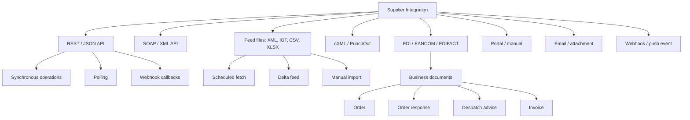
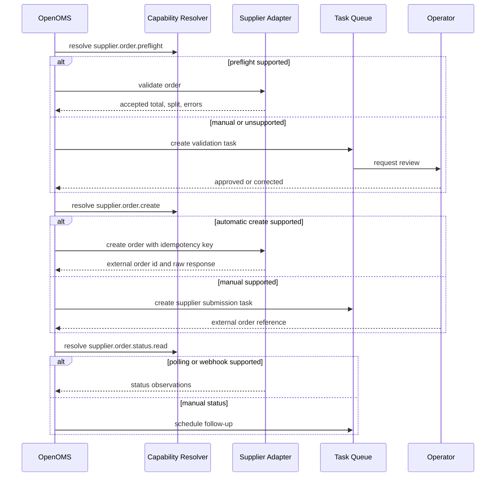
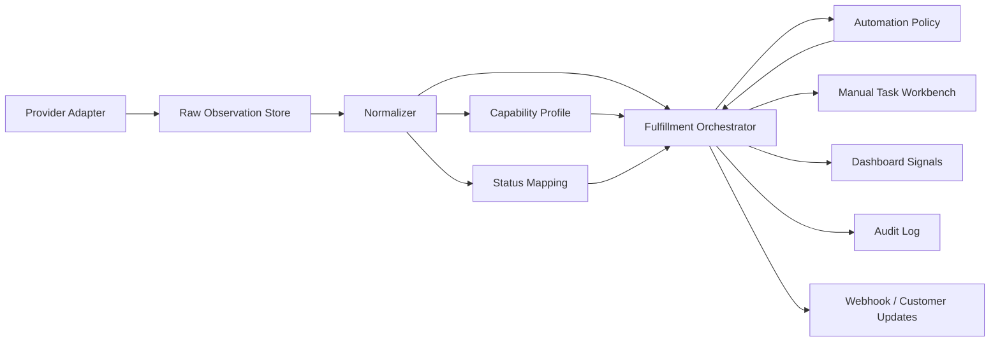

# OpenOMS — research integracji hurtowni i dostawców

- **Data:** 2026-05-17
- **Status:** research do docelowego modelu orkiestracji fulfillmentu
- **Zakres:** hurtownie, dostawcy dropshippingowi, dystrybutorzy B2B i standardy wymiany danych istotne dla polskiego i europejskiego e-commerce
- **Powiązane dokumenty:** `2026-05-21-ope-424-canonical-logistics-state-adr.md`, `2026-05-21-ope-425-orchestration-data-lifecycle.md`, `2026-05-17-fulfillment-orchestration-design.md`, `2026-05-17-provider-integration-studio-design.md`, `2026-05-17-provider-integration-studio-gap-analysis.md`, `2026-05-17-provider-integration-studio-production-readiness.md`, `2026-05-17-provider-integration-studio-ui-ux-design.md`, `2026-05-17-fulfillment-orchestration.md`, `../templates/provider-integration-builder.md`, `../templates/supplier-discovery-pack.md`

## Cel

Ten research ma odpowiedzieć na jedno praktyczne pytanie: jak realnie komunikują się hurtownie i dostawcy, żeby OpenOMS mógł poprawnie modelować automatyzację bez zakładania, że każdy partner ma kompletne API.

Wniosek główny jest jednoznaczny: **dostawca nie powinien być w systemie tylko `providerem`; powinien być kontem integracyjnym z udokumentowanym profilem zdolności.** Ten sam dostawca może mieć inne możliwości zależnie od kraju, konta, umowy, wersji API, pakietu B2B albo dostępu przyznanego przez opiekuna. Dlatego OpenOMS musi rozdzielić:

- kanał komunikacji,
- faktycznie obsługiwane zdolności,
- jakość i świeżość danych,
- mapowania statusów i pól,
- braki blokujące automatyzację,
- dowody z ostatnich synchronizacji, webhooków, pollingu albo ręcznych operacji.

## Źródła i zasady interpretacji

Research bazuje na publicznie dostępnych materiałach producentów/dostawców oraz na aktualnym kodzie OpenOMS. Publiczne dokumentacje często opisują możliwości ogólnie, a pełne specyfikacje bywają dostępne dopiero po zalogowaniu, podpisaniu aneksu lub przyznaniu dostępu partnerskiego. W takich przypadkach dokument oznacza zdolność jako "wymaga weryfikacji konta", nie jako gwarancję.

Użyte źródła zewnętrzne:

- [BigBuy API Guide](https://www.bigbuy.eu/public/doc/Guia_API_BigBuy_EN.pdf)
- [dropshippingXL / vidaXL Seller Guide](https://www.dropshippingxl.com/on/demandware.static/-/Library-Sites-vidaXLSharedLibrary/default/B2B_documents/seller_guide/EN.pdf)
- [dropshippingXL public page](https://www.dropshippingxl.com/us)
- [Matterhorn API Help Center](https://help.matterhorn-wholesale.com/CMS2/article/api/)
- [Matterhorn REST API guide](https://matterhorn-wholesale.com/?str=api-help)
- [Matterhorn PL XML/CSV integration help](https://help.matterhorn.pl/CMS2/article/czy-moge-polaczyc-sie-z-hurtownia-matterhorn/)
- [BTSWholesaler API Connection v2.0](https://api.btswholesaler.com/en/site/api)
- [MALFINI B2B REST](https://api.malfini.com/api-docs/index.html)
- [MALFINI B2B SOAP PDF](https://shop.malfini.com/file/pdf/pdf/b2b/B2B_soap_EN.pdf)
- [Ingram Micro Reseller API Overview](https://developer.ingrammicro.com/reseller/getting-started/api-overview)
- [Ingram Micro Xvantage APIs](https://na.ingrammicro.com/en-us/services/automation/apis)
- [TD SYNNEX Digital Bridge EU](https://developer.api.tdsynnex.com/eu)
- [TD SYNNEX Digital Bridge NA](https://www.tdsynnex.com/na/us/digital-bridge/)
- [AB S.A. XML protocol](https://ecommerce.ab.pl/en/technology/xml/)
- [ACTION S.A. E-commerce B2B integration](https://www.action.pl/pl/o-action/e-commerce-b2b)
- [ALSO EDI/XML order link](https://www.also.com/ec/cms5/es_2420/2420/services/it-services/edi-xml/index.jsp)
- [La Grana REST API](https://b2b.lagrana.pl/api_docs)
- [GS1 EANCOM message categories](https://support.gs1.org/support/solutions/articles/43000734250-what-kind-of-messages-does-gs1-eancom-provide-)
- [GS1 Germany EANCOM](https://www.gs1-germany.de/standards/datenaustausch/eancom/)
- [IdoSell IOF documentation](https://www.idosell.com/pl/developers/otwarte-standardy-i-api-do-integracji/internet-offer-format-iof-/dokumentacja-internet-offer-format-iof/)
- [cXML Reference Guide](https://xml.cxml.org/current/cXMLReferenceGuide.pdf)

Źródła z kodu OpenOMS:

- `apps/api-server/internal/integration/supplier.go`
- `apps/api-server/internal/model/supplier.go`
- `apps/api-server/internal/integration/btp/provider.go`
- `apps/api-server/internal/integration/carrier.go`

## Szybkie podsumowanie

Rynek dzieli się na sześć klas integracji:

1. **Pełne REST API commerce/dropshipping** — katalog, ceny, stock, zamówienia, statusy, tracking, czasem faktury i zwroty. Przykłady: BigBuy, Matterhorn API, BTSWholesaler, La Grana, Ingram Micro, TD SYNNEX.
2. **Hybryda API + feed** — bogaty katalog w XML/CSV/IOF, aktualny stock/cena lub zamówienia przez API. Przykład w OpenOMS: BTP.
3. **XML/SOAP B2B** — stabilne integracje dystrybutorskie, często starsze technologicznie, ale bogate funkcjonalnie. Przykłady: MALFINI SOAP, AB XML.
4. **EDI / EANCOM / EDIFACT / XML order link** — zamówienie, odpowiedź, awizo wysyłki, faktura, status transportu. Przykłady: ALSO, duzi dystrybutorzy IT/FMCG, scenariusze enterprise.
5. **Pliki CSV/XLSX/XML bez pełnej automatyzacji zamówień** — katalog, ceny i stock są dostępne, ale zamówienie/status idą przez panel, email, import pliku albo półautomatyczny XML.
6. **Portal/manual jako świadomy kanał** — brak API nie oznacza braku obsługi. Oznacza inny poziom automatyzacji i konieczność jawnego statusu "operator/supplier action required".

Najbardziej ryzykowne obszary:

- świeżość stocku i różne znaczenie "dostępności",
- częściowa realizacja zamówienia,
- brak potwierdzenia rezerwacji po wysłaniu zamówienia,
- tracking pojawiający się dopiero po wysyłce,
- różne statusy na poziomie zamówienia i pozycji,
- dostawca wybiera kuriera zamiast OpenOMS,
- dostawca dzieli jedno zamówienie na wiele paczek albo magazynów,
- usunięte produkty w feedzie nie zawsze znaczą to samo,
- różnice pomiędzy publiczną dokumentacją a dostępem konkretnego konta.

## Macierz researchu dostawców

| Dostawca / standard | Kanał | Dane katalogowe | Stock / cena | Zamówienie | Status / tracking | Faktury / zwroty | Najważniejsza implikacja dla OpenOMS |
| --- | --- | --- | --- | --- | --- | --- | --- |
| BigBuy | REST API, sandbox i production | Katalog, taxonomie, produkty, warianty, atrybuty, zdjęcia | Stock według produktu/wariantu, handling days i warehouse; rekomendowany polling stocku co 10-15 min | Check przed create, potem create; multi-warehouse może utworzyć kilka zamówień | Shipping API, carrier options; order create zwraca ID i URL; tracking wymaga osobnego modelu statusu/order read w konektorze | API guide obejmuje order/shipping; invoice/tracking są wskazane w dokumentacji API/referencji | OpenOMS musi mieć preflight order check, obsługę multi-warehouse split, częściowych błędów i alternatywnych SKU po EAN |
| dropshippingXL / vidaXL | CSV/XML feed, pluginy, API | Feedy krajowe, lokalny język, codzienne nowe produkty | Stock godzinowo, cena dziennie; reguła usunięcia z feedu zależy od stock/cena | Portal, bulk import, plugin/API auto-order | API deklaruje order status/tracking codes; tracking po dispatchu | API deklaruje invoice/credit note | Model musi obsłużyć różne kraje/feed URL i rozdzielić product feed od order API; rejestracja była publicznie oznaczona jako zakończona, więc dostęp wymaga weryfikacji biznesowej |
| Matterhorn PL | Pliki XLS/CSV/XML, integratory sklepów | Oferta w plikach integracyjnych | Pliki z ofertą/stockiem; szczegóły zależą od formatu | Dla części ścieżek zamówienie może iść poza API | Brak pełnej publicznej gwarancji w PL help dla statusu/tracking przez API | Zależne od panelu/procesu | Nie wolno mapować "Matterhorn" globalnie jako pełne API; profil musi być per konto/kraj |
| Matterhorn wholesale API | REST API + JSON, API key | Produkty masowo, filtrowanie po brand/category/new; product/variant IDs | Product data zawiera stock; można pobrać jeden produkt dla aktualnego stocku | PUT order z `variant_uid`, adresem dostawy, walutą i delivery method | GET order details; odpowiedź może zawierać status, `shipping_number`, `tracking_url`, `shipping_service`, invoice fields po wysyłce | Invoice number/url mogą pojawić się po wysyłce | Konieczne przechowywanie `variant_uid`; płatność nie zawsze przez API, więc `awaiting_payment` musi być osobnym statusem blokującym |
| BTSWholesaler | REST API v2, JWT, endpointy z panelu klienta | Pełny katalog paginowany, multi-language | Real-time stock/price, delta sync, feed status | `createOrder` dla dropshippingu | `getOrderStatus` obejmuje status i tracking | Brak pełnej publicznej tabeli faktur w otwartej stronie | Dobry wzorzec pełnego konektora API z delta sync; trzeba zapisać granice dostępnych endpointów przy konkretnym koncie |
| La Grana | REST API JSON + JWT, alternatywnie XML feed token | Produkty, kategorie, opisy, zdjęcia, atrybuty, indywidualne ceny | `stock_warehouse` i `stock_supplier`; endpoint stock | GET/POST orders, po ID/SKU, external ID | Lista zamówień zawiera status; brak publicznie widocznej pełnej mapy tracking | Brak publicznie widocznej faktury/tracking w otwartej doc | Dobry przykład polskiego REST API z osobnym stock własny/dostawcy; OpenOMS powinien rozróżniać źródło stocku i nie traktować sumy jako rezerwacji |
| BTP w OpenOMS | Basic Auth REST + opcjonalny XML catalogue URL | XML daje bogatszy katalog z obrazami/opisami; REST fallback skromniejszy | REST inventory report; kod sugeruje odświeżanie 4-24 razy dziennie | REST create order, `client_order_number`, `delivery_point_id`, `carrier_id`, `is_testing` | Obecny interfejs `SupplierProvider` nie ma odczytu statusu/tracking | Brak w obecnym providerze | To potwierdza potrzebę capabilities: obecny provider umie katalog, inventory, create order, ale nie deklaruje pełnej obserwowalności realizacji |
| MALFINI B2B REST/SOAP | REST docs + SOAP PDF | SOAP `products`; profile/dane konta | `stock`, `price_list`, availability po datach i nomenklaturze | `contract_at_once` tworzy order automatycznie, ma `test` mode i walidacje ceny/daty | `expedition_list`, `expedition_detail` | `invoice_list`, `invoice_detail` | Starszy SOAP bywa funkcjonalnie bardzo bogaty; OpenOMS powinien traktować protokół jako transport, a nie miarę jakości integracji |
| Ingram Micro | Reseller APIs, sandbox, production approval, webhooks | Product Catalog API | Real-time price/availability, stock by warehouse location | Orders API create/list | Real-time order status; webhooks dla order status i stock updates | Invoice, returns, freight estimate | Model enterprise: API + webhooki + sandbox + approval. OpenOMS powinien wspierać zarówno polling jak i push events w jednym profilu |
| TD SYNNEX | Digital Bridge REST APIs, data feeds, EDI, connectors | Catalogue API | Product/pricing/availability, data feeds | Order Management API; POs przez connector/API | Order status, ETA, shipping sync, invoices w Digital Bridge | After-sales/invoice obszary zależne od regionu; część funkcji oznaczona jako under construction w EU | Ten sam brand ma różne regiony i dojrzałość funkcji; profil musi mieć `region`, `environment`, `access_level`, `certification_state` |
| AB S.A. | Płatny XML protocol po aneksie | Lista produktów, opisy, parametry, zdjęcia, tree | Stany magazynowe AB | Listy zamówień i informacje o stanie zamówień; publiczna strona mówi o XML, ale nie pokazuje requestów | Status zamówień przez XML | Faktury i e-faktury przez XML | Dobry przykład "spec dostępny po umowie". OpenOMS powinien mieć workflow integracji partnerskiej z załączaniem spec i testami zgodności |
| ACTION S.A. | XLSX/CSV lub REST API/EDI | Ceny, stock, wymiary, waga, opisy, zdjęcia, kategorie, producenci | CSV/XLSX dla wszystkich B2B; REST API/EDI z różną częstotliwością i funkcjonalnością | REST API/EDI; publiczna strona wskazuje także edycję zamówień jako wyróżnik API | Zależne od API/EDI | Zależne od API/EDI | Klasyczna segmentacja dostępu: darmowy feed dla każdego B2B, bogatsze API/EDI po wdrożeniu |
| ALSO | EDI/XML direct order link, bespoke links | Real-time price and availability check | Real-time price/availability | XML order link; błędy order/price są zgłaszane natychmiast, zamówienie przetwarzane po akceptacji | Zależne od EDI/XML link | Zależne od wdrożenia | OpenOMS musi umieć modelować asynchroniczną akceptację: błąd/wątpliwość nie jest awarią systemu, tylko stanem wymagającym decyzji |
| IOF / IdoSell | Otwarty XML format oferty | `gateway.xml` wskazuje pliki full/light/change/reference; opis, ceny, zdjęcia, załączniki, kategorie, rozmiary | Ceny w walutach, ilości w konkretnym magazynie | IOF jest formatem oferty, nie kompletnym protokołem order/status | Brak natywnego order tracking | Brak natywnego invoice/RMA | Świetny standard importu katalogu; nie wolno z niego wywodzić zdolności fulfillmentu |
| GS1 EANCOM / EDI | EDIFACT subset / EDI | Master data, party/product information | Report/planning messages mogą obejmować sprzedaż i stock | ORDERS, ORDRSP, ORDCHG | DESADV, transport/logistics, IFTSTA | INVOIC, financial messages | Dla większych B2B OpenOMS powinien myśleć dokumentami biznesowymi, nie endpointami |
| cXML | XML over HTTP(S), PunchOut / procurement | PunchOut/catalog/session | Real-time pricing/inventory podczas PunchOut zależnie od supplier site | OrderRequest po zatwierdzeniu requisition | Ship notice/status są osobnymi dokumentami w ekosystemie cXML | Invoice documents | Ważne dla B2B procurement, mniej dla klasycznego dropshippingu; wymaga profilu dokumentów i routing endpointów |

## Taksonomia kanałów komunikacji



### REST / JSON API

Najbardziej ergonomiczny kanał dla OpenOMS, ale nie zawsze najpełniejszy. Może obejmować tylko katalog i stock, a zamówienia mogą dalej wymagać panelu. W dojrzałych przypadkach REST daje pełny cykl: katalog, price/availability, preflight order, create order, order status, tracking, invoice i returns.

Wymagania OpenOMS:

- osobny adapter per provider/version,
- autoryzacja w profilu credentials,
- rate limit i retry policy per endpoint,
- polling schedule per capability,
- idempotency key dla order create, jeśli dostawca wspiera,
- raw request/response fingerprint bez sekretów,
- mapowanie błędów biznesowych i transportowych.

### SOAP / XML API

SOAP nie powinien być traktowany jako "legacy problem" sam w sobie. MALFINI pokazuje, że SOAP może dawać bogate funkcje: produkty, stock, ceny, order create, expedition lists i invoices. Problemem nie jest XML, tylko brak jawnego profilu zdolności i testów zgodności.

Wymagania OpenOMS:

- adapter XML z walidacją schematu, jeśli schemat jest dostępny,
- wersjonowanie transformacji,
- normalizacja dat, walut i ilości,
- pełne przechowywanie external document IDs,
- ścisłe timeouty i bounded reads.

### EDI / EANCOM / EDIFACT

EDI jest lepsze dla stabilnych relacji B2B niż dla szybkiego onboardingowania małych dostawców. Zaletą jest precyzyjny model dokumentów biznesowych: zamówienie, potwierdzenie, zmiana, awizo wysyłki, faktura, status transportu. Wadą jest koszt wdrożenia, dłuższy onboarding i różne profile partnerów.

Wymagania OpenOMS:

- kanoniczny model dokumentów,
- mapowanie partner-specific,
- acknowledgements i reprocessing,
- reconciliation dokumentów z zamówieniami,
- status "document accepted/rejected" niezależny od statusu zamówienia,
- przechowywanie wersji specyfikacji i profilu partnera.

### cXML / PunchOut

cXML jest ważne dla zakupów B2B/procurement. Typowy flow: system zakupowy inicjuje PunchOut, użytkownik wybiera produkty na stronie dostawcy, koszyk wraca jako PunchOutOrderMessage, a po zatwierdzeniu powstaje OrderRequest do dostawcy. To nie jest zwykły feed produktów; źródłem prawdy dla koszyka i cen jest sesja dostawcy.

Wymagania OpenOMS:

- endpointy cXML,
- obsługa buyer/supplier cookies,
- oddzielenie quote/cart od booked order,
- routing OrderRequest,
- audyt surowych dokumentów XML,
- mapowanie ship notice i invoice, jeśli partner je wysyła.

### Feed files: XML, IOF, CSV, XLSX

Feed to najczęstszy i najtańszy sposób integracji katalogu. Jest dobry dla produktów, cen, zdjęć i stocku, ale zwykle nie daje pełnej transparentności realizacji zamówienia.

Wymagania OpenOMS:

- connector dla fetch/import,
- parser per format/version,
- wykrywanie różnic i usunięć,
- polityka świeżości,
- semantyka "produkt zniknął z feedu",
- mapa pól feedu do canonical supplier product,
- osobne zdolności dla order/status/tracking, bez domyślnego zakładania, że istnieją.

### Portal / manual / email

To musi być pierwszorzędny kanał, nie wyjątek. Wielu klientów będzie mieć dostawcę, który ma tylko panel B2B lub przyjmuje zamówienia mailem. OpenOMS nadal może orkiestratorowo prowadzić proces: zebrać dane, wygenerować dokument, przypisać zadanie operatorowi, zapisać potwierdzenie, przypomnieć o braku tracking number i pokazać ryzyko na dashboardzie.

Wymagania OpenOMS:

- manual task jako element workflow,
- SLA i eskalacja,
- attachment/document export,
- supplier portal dla potwierdzeń,
- audit trail,
- brak udawania automatyzacji tam, gdzie jej nie ma.

## Kanoniczne rodziny wiadomości

OpenOMS powinien myśleć w rodzinach wiadomości, niezależnie od transportu:

| Rodzina | Cel | Typowe źródła |
| --- | --- | --- |
| `catalog_snapshot` | Pełny katalog dostawcy | XML/CSV/IOF, REST catalog, SOAP products |
| `catalog_delta` | Zmiany od ostatniej synchronizacji | REST delta, feed change, webhook |
| `price_snapshot` | Ceny konta, waluta, VAT, rabaty | REST, XML, SOAP, EDI PRICAT |
| `availability_snapshot` | Stock i dostępność | REST stock, XML stock, SOAP stock |
| `availability_delta` | Zmiana stocku | webhook, delta feed, polling |
| `supplier_order_request` | Złożenie zamówienia u dostawcy | REST create, SOAP contract, EDI ORDERS, cXML OrderRequest, portal task |
| `supplier_order_ack` | Potwierdzenie przyjęcia lub odrzucenia | REST response, ORDRSP, portal confirmation |
| `supplier_order_status` | Status realizacji zamówienia | REST GET order, webhook, EDI, portal update |
| `supplier_line_status` | Status pozycji | REST order detail, EDI line response |
| `shipment_notice` | Paczka, kurier, tracking | DESADV, ship notice, REST order detail |
| `tracking_event` | Zdarzenie kurierskie | Carrier API, supplier tracking, marketplace tracking |
| `invoice_document` | Faktura lub korekta | REST invoice, SOAP invoice, EDI INVOIC |
| `return_rma` | Zwrot/reklamacja | REST returns, portal, marketplace return |
| `integration_error` | Błąd techniczny lub biznesowy | Adapter, provider response, parser |

## Capability profile

Każda integracja powinna mieć profil zdolności w stylu:

```json
{
  "capability": "supplier.order.status.read",
  "support": "supported",
  "channel": "rest_api",
  "mode": "polling",
  "freshness": {
    "expected_interval_seconds": 300,
    "max_stale_seconds": 1800
  },
  "authority": "provider",
  "mapping_required": true,
  "required_input_fields": ["external_order_id"],
  "provided_fields": ["raw_status", "tracking_number", "tracking_url", "carrier"],
  "known_missing_fields": [],
  "verification_state": "verified",
  "last_verified_at": "2026-05-17T00:00:00Z"
}
```

Wartości `support`:

- `supported` — działa i jest zweryfikowane na koncie integracyjnym.
- `partially_supported` — działa tylko dla części procesu albo danych.
- `manual_supported` — OpenOMS potrafi prowadzić proces przez operatora/portal.
- `not_supported` — dostawca lub konto tego nie oferuje.
- `unknown` — brak dowodu; nie wolno automatyzować bez weryfikacji.

Wartości `channel`:

- `rest_api`
- `soap_api`
- `edi`
- `cxml`
- `webhook`
- `feed_xml`
- `feed_iof`
- `feed_csv`
- `feed_xlsx`
- `portal`
- `email`
- `manual`

Wartości `authority`:

- `provider` — dostawca jest źródłem prawdy.
- `marketplace` — marketplace jest źródłem prawdy.
- `carrier` — kurier jest źródłem prawdy.
- `openoms` — OpenOMS jest źródłem decyzji/statusu.
- `operator` — status wymaga potwierdzenia człowieka.
- `derived` — wartość wyliczona z innych obserwacji.

## Minimalny zestaw capabilities dla dostawców

| Capability | Znaczenie | Czy blokuje automatyzację |
| --- | --- | --- |
| `supplier.catalog.read` | Pobieranie produktów | Blokuje automatyczne wystawianie/import produktów |
| `supplier.catalog.delta.read` | Pobieranie zmian | Nie blokuje, ale wpływa na koszt i świeżość |
| `supplier.price.read` | Ceny konta | Blokuje automatyczne marże/cenniki |
| `supplier.availability.read` | Stock/dostępność | Blokuje bezpieczną sprzedaż bez własnego bufora |
| `supplier.availability.exact_quantity` | Dokładna ilość | Wpływa na strategię rezerwacji |
| `supplier.availability.by_warehouse` | Stock per magazyn/handling | Wymaga mapowania lead time i splitu |
| `supplier.order.preflight` | Walidacja przed złożeniem | Silnie zalecane przy dropshippingu |
| `supplier.order.create` | Automatyczne złożenie zamówienia | Blokuje pełny auto-submit |
| `supplier.order.cancel` | Anulowanie | Nie zawsze dostępne; brak wymaga manualnego taska |
| `supplier.order.status.read` | Odczyt statusu | Blokuje pełną transparentność po submit |
| `supplier.order.line_status.read` | Status pozycji | Potrzebne przy partial/backorder |
| `supplier.shipment.notice.read` | Informacja o wysyłce | Blokuje automatyczny tracking push |
| `supplier.tracking.read` | Tracking number/url | Blokuje aktualizację marketplace/customer |
| `supplier.invoice.read` | Faktura | Wpływa na księgowość/reconciliation |
| `supplier.return.create` | RMA/zwrot | Wpływa na obsługę returns |
| `supplier.error.structured` | Strukturalne błędy biznesowe | Ułatwia automatyczne recoveries |

## Kanoniczny status zamówienia u dostawcy

Dostawcy często mają statusy tekstowe, lokalne, niestabilne albo osobne statusy dla pozycji. OpenOMS powinien przechowywać raw status i mapować go na kanoniczny status z confidence.

Proponowany zestaw:

| Status | Znaczenie |
| --- | --- |
| `draft` | Zamówienie przygotowane w OpenOMS, jeszcze niewysłane |
| `submitted` | Wysłane do dostawcy, brak potwierdzenia |
| `accepted` | Dostawca przyjął do realizacji |
| `awaiting_payment` | Wymagana płatność lub doładowanie salda |
| `waiting_for_stock` | Dostawca czeka na dostępność |
| `partially_accepted` | Część pozycji przyjęta, część odrzucona/backorder |
| `processing` | Realizacja w toku |
| `packed` | Przygotowane do wysyłki |
| `ready_for_pickup` | Czeka na odbiór kuriera |
| `partially_shipped` | Część pozycji/paczek wysłana |
| `shipped` | Wysłane |
| `delivered` | Dostarczone |
| `cancelled` | Anulowane |
| `rejected` | Odrzucone przez dostawcę |
| `returned` | Zwrot do dostawcy |
| `unknown` | Status nierozpoznany, wymaga mapowania |

Status `unknown` nie jest błędem technicznym. Jest brakiem mapowania i powinien tworzyć `integration_capability_gap` lub `external_status_mapping` w stanie wymagającym decyzji.

## Dostępność i stock — konieczne rozróżnienia

Stock w feedzie nie oznacza rezerwacji. OpenOMS musi przechowywać co najmniej:

- `source_quantity` — surowa ilość z dostawcy,
- `available_to_sell` — ilość po regułach bezpieczeństwa klienta,
- `availability_type` — `exact_quantity`, `bucket`, `boolean`, `eta_only`, `unknown`,
- `warehouse_external_id`,
- `min_handling_days`,
- `max_handling_days`,
- `next_delivery_date`,
- `freshness_observed_at`,
- `max_stale_at`,
- `reservation_supported`,
- `last_successful_sync_id`.

Domyślny tryb OpenOMS powinien automatycznie wykorzystywać świeżą, zaufaną dostępność dostawcy do przeliczenia `available_to_sell` i propagacji stocku na kanały sprzedaży. Ten automat musi działać w obie strony: spadek dostępności zmniejsza stock w kanałach, a wzrost dostępności może zwiększyć stock w kanałach tylko wtedy, gdy tenant policy, świeżość danych, bufor bezpieczeństwa, lead time i możliwość preflight/rezerwacji na to pozwalają.

Ręczna kontrola musi pozostać dostępna per dostawca, produkt, listing i kanał. Tryby `manual`, `paused` oraz `override_quantity` są wymagane, bo część hurtowni ma niestabilne feedy, opóźnione stany, różne progi dostępności albo warunki handlowe zależne od konta. Aktywny override nie może być nadpisany przez automat bez jawnej polityki i audytu.

Praktyczne wnioski ze źródeł:

- BigBuy rozbija stock według handling days i magazynu, co wymusza model lead time.
- vidaXL opisuje feedy z aktualizacją stocku godzinowo i cen dziennie, co oznacza różne SLA per rodzina danych.
- La Grana rozdziela `stock_warehouse` i `stock_supplier`, więc "stock" nie zawsze jest jedną liczbą.
- AB/ACTION/IOF pokazują, że pliki mogą zawierać stock, ale bez gwarancji rezerwacji.
- MALFINI pozwala pytać o dostępność po datach, więc status dostępności może być funkcją czasu, a nie stałą liczbą.

## Zamówienie u dostawcy — model docelowy

OpenOMS powinien rozdzielić cztery fazy:

1. **Prepare** — kompletacja danych i walidacja po stronie OpenOMS.
2. **Preflight** — sprawdzenie u dostawcy: stock, cena, adres, carrier, payment, split.
3. **Submit** — utworzenie zamówienia/dokumentu.
4. **Reconcile** — porównanie odpowiedzi, statusów, trackingów i faktur z kanonicznym zamówieniem.



## Braki danych jako pierwszorzędny element systemu

Brak pola nie powinien być ukryty w logu adaptera. Powinien tworzyć obiekt operacyjny:

| Typ braku | Skutek |
| --- | --- |
| `missing_required_input` | Proces nie może przejść dalej bez danych klienta/operatora |
| `missing_mapping` | Zewnętrzny status/pole nie ma mapowania |
| `unsupported_capability` | OpenOMS nie może wykonać automatycznej akcji dla tej integracji |
| `stale_data` | Dane są starsze niż profil świeżości |
| `ambiguous_identity` | SKU/EAN/external ID nie wskazuje jednoznacznie produktu |
| `provider_business_error` | Dostawca odrzucił biznesowo operację |
| `provider_transport_error` | Problem HTTP/SOAP/EDI/timeout/auth |
| `manual_action_required` | Proces wymaga człowieka, ale jest kontrolowany |

Dashboard powinien pokazywać te braki jako:

- blokujące,
- wymagające decyzji,
- informacyjne,
- monitorowane w tle.

Nie powinien zasypywać dashboardu surowymi detalami protokołów.

## Model evidence

Żeby orkiestrator był transparentny, każde istotne przejście powinno mieć dowód:

| Evidence | Zawartość |
| --- | --- |
| `api_response` | endpoint, status code, correlation id, safe payload hash, normalized fields |
| `webhook_event` | provider event id, event type, received at, signature verification result |
| `feed_snapshot` | URL/key hash, format, row count, checksum, observed at |
| `edi_document` | document type, partner id, control number, acknowledgement status |
| `manual_confirmation` | operator/supplier actor, timestamp, entered fields, attachment refs |
| `carrier_tracking_event` | carrier, tracking number, raw status, normalized status |
| `system_decision` | rule id, automation policy, input facts, decision result |

Ten model jest ważniejszy niż sam wybór narzędzia workflow. Bez evidence OpenOMS nie będzie potrafił odpowiedzieć klientowi: "gdzie dokładnie utknęło zamówienie i dlaczego".

## Onboarding dostawcy — checklista do wizardu

Każdy dostawca powinien przejść przez kontrolowany wizard:

1. **Tożsamość dostawcy**
   - nazwa, kraj, region, konto B2B, opiekun, środowisko testowe/produkcyjne,
   - czy provider ma publiczny adapter OpenOMS, custom adapter, feed, EDI, portal.

2. **Katalog**
   - kanał: REST, SOAP, XML, IOF, CSV, XLSX, EDI, manual,
   - identyfikatory: supplier product ID, SKU, EAN, variant ID,
   - pola: nazwa, opis, zdjęcia, brand, kategorie, atrybuty, waga, wymiary, VAT,
   - semantyka usunięć i dezaktywacji.

3. **Cena**
   - net/gross, waluta, VAT, ceny indywidualne, progi ilościowe,
   - częstotliwość aktualizacji,
   - czy cena może zmienić się między preflight i submit.

4. **Stock**
   - exact quantity, boolean, availability bucket, ETA, warehouse, handling days,
   - częstotliwość aktualizacji,
   - czy można rezerwować,
   - czy stock dostawcy jest własny czy zewnętrzny.

5. **Zamówienie**
   - automatyczne create, upload pliku, EDI, email, portal,
   - wymagane pola adresu, telefon/email, NIP, uwagi, delivery point,
   - czy obsługiwany jest split, partial, backorder,
   - idempotency/external reference.

6. **Płatność**
   - saldo, przelew, karta, kredyt kupiecki, płatność po emailu/panelu,
   - czy brak płatności blokuje realizację,
   - czy status płatności jest dostępny technicznie.

7. **Dostawa**
   - kto wybiera kuriera,
   - czy OpenOMS może wskazać carrier/service,
   - czy dostawca zwraca koszt dostawy przed zamówieniem,
   - czy tracking jest per order, per shipment, per line.

8. **Statusy**
   - lista raw statusów,
   - poziom: order, line, shipment, invoice,
   - mapowanie na canonical status,
   - co oznacza brak statusu przez określony czas.

9. **Faktury i dokumenty**
   - invoice list/detail, PDF, credit note,
   - czy dokument jest dostępny przez API/feed/panel,
   - czy ma być importowany do OpenOMS.

10. **Zwroty i reklamacje**
    - czy supplier obsługuje RMA,
    - czy można utworzyć return,
    - czy status return jest widoczny.

11. **Błędy i limity**
    - rate limits,
    - retryable/non-retryable errors,
    - auth expiry,
    - maintenance windows,
    - SLA dostawcy.

12. **Weryfikacja**
    - test credentials,
    - sample product,
    - sample order,
    - sample tracking,
    - sample invoice,
    - potwierdzone capabilities.

## Weryfikacja capabilities

OpenOMS powinien mieć automatyczne testy/proby integracji:

| Próba | Cel | Wynik |
| --- | --- | --- |
| `auth.check` | Czy credentials działają | active/error |
| `catalog.sample` | Czy można pobrać próbkę katalogu | fields coverage |
| `catalog.full.dry_run` | Czy pełny katalog mieści się w limitach | count/checksum/duration |
| `stock.sample` | Czy stock ma oczekiwaną semantykę | exact/bucket/boolean |
| `price.sample` | Czy cena ma walutę/VAT | normalized money |
| `order.preflight.sample` | Czy dostawca waliduje zamówienie bez utworzenia | supported/not_supported |
| `order.create.test` | Czy można stworzyć test order | external id |
| `order.status.sample` | Czy status jest odczytywalny | raw + normalized |
| `shipment.sample` | Czy tracking pojawia się w danych | tracking fields |
| `invoice.sample` | Czy faktura jest dostępna | document ref |

Wyniki tych prób powinny aktualizować `integration_capability_profiles` i tworzyć obserwacje, ale nie powinny same uruchamiać produkcyjnej automatyzacji bez zatwierdzonej polityki klienta.

## Marketplace a dostawca

Marketplace i dostawca mają podobny problem mapowania, ale inne źródło presji:

- marketplace wymaga szybkiej i poprawnej aktualizacji statusu/tracking/stock, bo wpływa na jakość konta sprzedawcy,
- dostawca wymaga poprawnego zamówienia i kontroli braków, bo wpływa na realną realizację,
- własny sklep może mieć większą elastyczność komunikacji z klientem, ale nadal potrzebuje prawdy o statusie.

Dlatego OpenOMS powinien mieć wspólny model `external_status_mapping`, ale osobne domeny:

- `marketplace_order_status`,
- `supplier_order_status`,
- `carrier_tracking_status`,
- `internal_fulfillment_status`.

Jeden surowy status nie powinien bezpośrednio przepisywać całego zamówienia. Powinien wejść jako obserwacja, a canonical state machine powinna zdecydować, co to oznacza.

## Rekomendowany model architektoniczny



Elementy:

- **Provider Adapter** — transport i provider-specific auth.
- **Raw Observation Store** — każda odpowiedź/event/feed jako dowód.
- **Normalizer** — transformacja do canonical facts.
- **Capability Profile** — co ta integracja faktycznie potrafi.
- **Status Mapping** — raw status do canonical status z confidence.
- **Fulfillment Orchestrator** — decyzje procesowe.
- **Automation Policy** — konfiguracja klienta, nie hard-coded automaty.
- **Manual Task Workbench** — kontrolowany proces ręczny.
- **Dashboard Signals** — agregaty: ile zamówień utknęło i dlaczego.
- **Audit Log** — historia decyzji i działań.

## Konsekwencje dla obecnego kodu OpenOMS

Aktualny `SupplierProvider` ma trzy metody: `FetchProducts`, `FetchInventory`, `CreateOrder`. To jest dobry początek dla katalogu i submitu, ale za wąski dla transparentnego fulfillmentu. Brakuje jawnych metod lub osobnych optional interfaces dla:

- `CheckOrder` / preflight,
- `GetOrderStatus`,
- `GetOrderLines`,
- `GetShipments`,
- `GetTracking`,
- `GetInvoices`,
- `CancelOrder`,
- `SupportsCapability`.

Lepszy kierunek to wzorzec podobny do carrierów, gdzie część możliwości może być optional interface, ale capability profile i tak jest zapisywany w DB. Sam fakt, że adapter implementuje metodę, nie wystarcza; musi być jeszcze zweryfikowane, że konkretne konto ją obsługuje.

Proponowane interfejsy koncepcyjne:

```go
type SupplierOrderChecker interface {
    CheckOrder(ctx context.Context, req SupplierOrderRequest) (*SupplierOrderCheckResult, error)
}

type SupplierOrderStatusReader interface {
    GetOrderStatus(ctx context.Context, externalOrderID string) (*SupplierOrderStatusResult, error)
}

type SupplierShipmentReader interface {
    GetShipments(ctx context.Context, externalOrderID string) ([]SupplierShipment, error)
}

type SupplierInvoiceReader interface {
    GetInvoices(ctx context.Context, externalOrderID string) ([]SupplierInvoice, error)
}

type SupplierCapabilityReporter interface {
    DescribeCapabilities(ctx context.Context) ([]ProviderCapability, error)
}
```

Te interfejsy nie zastępują profilu w DB. One służą tylko adapterowi. Źródłem prawdy dla orkiestratora powinien być zweryfikowany profil, bo niektóre możliwości zależą od konta.

## Polityki automatyzacji

Automatyzacja nie powinna być binarna. Dla każdej akcji potrzebny jest tryb:

| Tryb | Znaczenie |
| --- | --- |
| `automatic` | OpenOMS wykonuje akcję bez człowieka |
| `automatic_with_guardrails` | OpenOMS wykonuje, jeśli warunki bezpieczeństwa są spełnione |
| `approval_required` | OpenOMS przygotowuje akcję, człowiek zatwierdza |
| `manual_task` | OpenOMS tworzy zadanie i pilnuje SLA |
| `disabled` | Akcja świadomie wyłączona |

Reguły bezpieczeństwa:

- nie submituj zamówienia bez świeżego stocku, jeśli klient tak ustawi,
- nie submituj, jeśli cena wzrosła powyżej tolerancji,
- nie submituj, jeśli adres nie spełnia reguł dostawcy,
- nie pushuj tracking do marketplace bez pewnego carrier/tracking number,
- nie oznaczaj zamówienia jako shipped tylko dlatego, że supplier order jest accepted,
- nie ukrywaj partial failures.

## Dashboard operacyjny

Dashboard powinien pokazywać ogólny widok:

- zamówienia gotowe do automatycznego submitu,
- zamówienia czekające na dostawcę,
- zamówienia wymagające danych,
- zamówienia z nierozpoznanym statusem,
- zamówienia ze starym stockiem,
- zamówienia bez tracking po SLA,
- integracje z błędami auth/transport/parser,
- automatyzacje zatrzymane przez politykę klienta.

Kliknięcie w problem powinno prowadzić do szczegółów evidence i raw observation, ale pierwszy widok ma być operacyjny, nie debugowy.

## Najważniejsze decyzje projektowe

1. **Provider name nie wystarcza.** Zdolności są per tenant integration account.
2. **Feed to nie fulfillment.** XML/CSV/IOF może dać katalog i stock, ale nie status zamówienia.
3. **Manual jest pełnoprawnym kanałem.** OpenOMS powinien orkiestratorowo kontrolować także procesy ręczne.
4. **Status raw zawsze zostaje.** Normalizacja nie może usuwać oryginalnego statusu.
5. **Freshness jest częścią danych.** Stock sprzed 2 godzin i stock sprzed 2 minut to inne fakty.
6. **Preflight jest krytyczny.** Przy dropshippingu należy sprawdzać cenę, stock i adres przed submit, jeśli dostawca na to pozwala.
7. **Partial jest normą.** Multi-warehouse, backorder i częściowe błędy muszą być podstawową ścieżką.
8. **Webhook i polling współistnieją.** Push event nie zwalnia z reconciliation pollingu.
9. **Brak mapowania jest stanem operacyjnym.** Nie jest tylko logiem developera.
10. **Spec partnera jest artefaktem.** Przy AB/ACTION/EDI/ALSO specyfikacje po umowie muszą być dołączone do profilu integracji i wersjonowane.

## Rekomendowany zakres następnej specyfikacji technicznej

Ten research powinien zostać przełożony na osobny projekt techniczny:

- schema DB dla capability profiles, observations, mappings i gaps,
- rozszerzenie supplier provider optional interfaces,
- status mapping engine,
- integration onboarding wizard,
- background probes,
- dashboard problem signals,
- test harness dla dostawców,
- dokumentacja dla custom connectorów.

## Self-review

- Brak sekcji oznaczonych jako do uzupełnienia.
- Każda opisana zdolność rozdziela źródło publiczne od wymaganej weryfikacji konta.
- Dokument nie zakłada jednego uniwersalnego API dostawcy.
- Dokument obejmuje zarówno nowoczesne REST API, jak i realne kanały B2B: SOAP, XML, EDI, cXML, feedy i manual.
- Model jest zgodny z aktualnym kierunkiem fulfillment orchestration: capability profiles, evidence, mapping gaps i dashboard problem signals.
